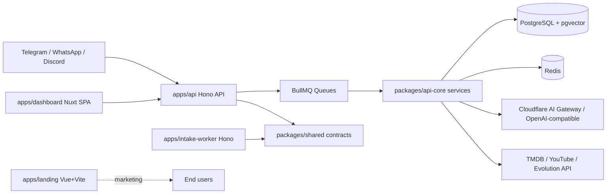

# Nexo AI Monorepo — Codebase Context

> Generated on 2026-04-10

> Auto-generated by Codebase Context Mapper on 2026-04-10
> Last updated: 2026-04-10T10:37:57-03:00
> Source: /home/psousaj/projects/jose/nexo-ai
> Repo state: feature/agentic-runtime-openai-sdk @ 499537d

## What is this

Nexo AI is a TypeScript monorepo for a multi-channel messaging assistant that captures, enriches, stores, and searches user memory (movies, series, videos, links, notes, reminders). It combines webhook-driven ingestion from messaging providers, deterministic runtime orchestration, AI-assisted planning, semantic search, and a web dashboard for profile/admin operations.

## Architecture at a glance

Monorepo with four deployable apps (`api`, `dashboard`, `intake-worker`, `landing`) plus shared packages; the runtime-critical business logic is centralized in `packages/api-core`, while `apps/api` is the Hono delivery shell.

## Tech stack summary

- **Language(s):** TypeScript 5.x, Vue SFC, YAML, SQL (Drizzle migrations)
- **Framework(s):** Hono, Nuxt 4, Vue 3, BullMQ, Drizzle ORM
- **Database(s):** PostgreSQL (JSONB + pgvector), Redis
- **Infrastructure:** Docker Compose (Jaeger/Prometheus/Evolution local), Vercel (dashboard/landing), GitHub Actions
- **Build:** pnpm workspaces + TurboRepo + tsup + Vite/Nuxt build

## Quick stats

| Metric | Value |
|--------|-------|
| Top-level modules (`apps/*` + `packages/*`) | 10 |
| Source files (repo scan) | 502 |
| Test files (repo scan) | 59 |
| Approximate LOC (`apps/*` + `packages/*`) | 54,463 |
| Applications under `apps/` | 4 |

## Critical knowledge

1. Runtime orchestration is deterministic by design: the LLM plans/writes, but state transitions and execution control stay in code (`packages/api-core/src/services/agent-orchestrator.ts`).
2. Message processing is asynchronous through BullMQ queues; webhook routes enqueue and return quickly (`apps/api/src/routes/webhook-new.ts`, `packages/api-core/src/services/queue-service.ts`).
3. The real backend domain/service layer lives in `packages/api-core`; `apps/api` mostly wires server boot, middleware, and routes.
4. Authentication uses Better Auth sessions/cookies, with explicit DB-user existence checks to avoid stale cookie cache issues (`apps/api/src/middlewares/auth.middleware.ts`).
5. Feature flags are persisted in database tables and mirrored into OpenFeature in-memory provider at runtime (`packages/api-core/src/services/feature-flag.service.ts`).
6. Data model relies heavily on JSONB and vector embeddings (`memory_items.embedding` 384 dims), enabling hybrid semantic + keyword search (`packages/api-core/src/services/memory-search.ts`).
7. The dashboard is SPA mode (`ssr: false`) and depends on API cookies; role checks exist in both frontend middleware and backend admin middleware.
8. `apps/landing/src/App.vue.js` appears to be generated JS committed into source; this inflates LOC and can confuse static analysis.
9. Intake Worker is intentionally small and currently uses stub OCR/STT adapters; contract stability exists, but extraction quality is placeholder today.
10. CI in this repo is currently lightweight (lint + typecheck workflow); there is no monorepo-wide automated coverage gate in GitHub Actions.

## Monorepo context documents

| Application | Context entry |
|----------|-------------|
| API | [apps/api/CODEBASE.md](./apps/api/CODEBASE.md) |
| Dashboard | [apps/dashboard/CODEBASE.md](./apps/dashboard/CODEBASE.md) |
| Intake Worker | [apps/intake-worker/CODEBASE.md](./apps/intake-worker/CODEBASE.md) |
| Landing | [apps/landing/CODEBASE.md](./apps/landing/CODEBASE.md) |

## Notes

This top-level file is an index for per-app deep analysis as required by the monorepo scaling rule of the Codebase Context Mapper spec.
