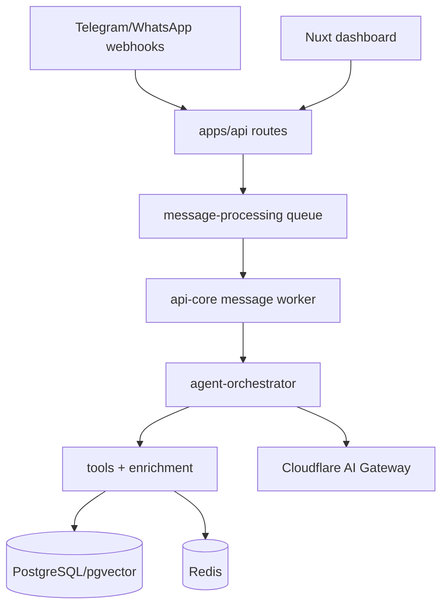

# API Application Context

> Generated on 2026-04-10

> Auto-generated by Codebase Context Mapper on 2026-04-10
> Last updated: 2026-04-10T10:37:57-03:00
> Source: apps/api
> Repo state: feature/agentic-runtime-openai-sdk @ 499537d

## What is this

`apps/api` is the Hono runtime shell for Nexo AI backend delivery. It exposes HTTP routes for health, webhooks, dashboard APIs, auth, and docs, while delegating most business logic to `apps/api/src`. It also boots observability, feature flags, Discord bot startup, queue workers, and graceful shutdown behavior.

## Architecture at a glance

Thin transport layer (`apps/api`) + shared domain/application layer (`apps/api/src`) + async queue processing (`BullMQ`).

## Tech stack summary

- **Language(s):** TypeScript 5.x
- **Framework(s):** Hono, BullMQ, Drizzle ORM
- **Database(s):** PostgreSQL + pgvector, Redis
- **Infrastructure:** Docker image for API runtime, OpenTelemetry/Sentry/Langfuse
- **Build:** pnpm + Turbo + tsup

## Quick stats

| Metric | Value |
|--------|-------|
| Modules/packages (app-level areas) | 8 |
| Source files | 77 |
| Test files | 49 |
| Approximate LOC | 9,339 |

## Critical knowledge

1. `apps/api/src/index.ts` only boots server/integration concerns; business logic is mostly in `apps/api/src`.
2. Webhooks enqueue jobs and return quickly; heavy processing is handled by workers.
3. Auth is Better Auth cookie-based and validated again against DB user existence.
4. Admin endpoints are protected by both auth and role middleware.
5. Runtime feature flags are loaded from DB and surfaced through OpenFeature.
6. Queue workers are created on app startup and connected to Redis immediately.
7. OpenAPI docs are manually defined and not fully generated from route schemas.
8. Some critical behavior is in large files (`agent-orchestrator.ts`, `tools/index.ts`) under `apps/api/src`.

## Context documents

| Document | Description |
|----------|-------------|
| [ARCHITECTURE.md](./ARCHITECTURE.md) | System design, boundaries, topology |
| [TECH_STACK.md](./TECH_STACK.md) | Languages, frameworks, dependencies |
| [DOMAIN_MODEL.md](./DOMAIN_MODEL.md) | Business entities, contexts, data flow |
| [MODULES.md](./MODULES.md) | Module inventory and responsibilities |
| [PATTERNS.md](./PATTERNS.md) | Code patterns and conventions |
| [DATA_LAYER.md](./DATA_LAYER.md) | Databases, ORMs, caching |
| [API_SURFACE.md](./API_SURFACE.md) | APIs, contracts, integrations |
| [TESTING.md](./TESTING.md) | Test strategy and frameworks |
| [BUILD_AND_DEPLOY.md](./BUILD_AND_DEPLOY.md) | CI/CD, build system, environments |
| [TECH_DEBT.md](./TECH_DEBT.md) | Known debt and risk areas |
| [CONVENTIONS.md](./CONVENTIONS.md) | Naming, organization, workflow |
| [GLOSSARY.md](./GLOSSARY.md) | Project-specific terminology |
