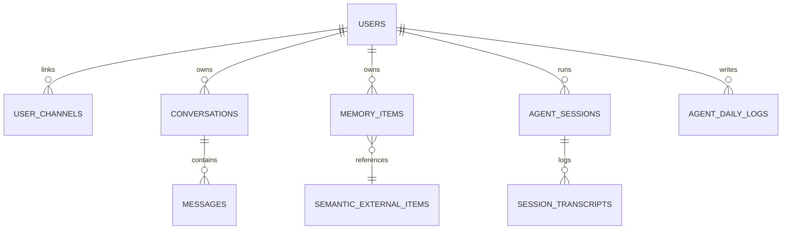
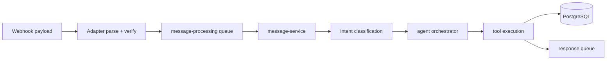

# Domain Model

> Generated on 2026-04-10

> Last updated: 2026-04-10T10:37:57-03:00
> Repo state: feature/agentic-runtime-openai-sdk @ 499537d

## Overview

The backend domain models a user-centric memory assistant. A user can link messaging channels, generate conversations/messages, and persist memory items enriched with metadata and embeddings. The model also includes runtime agent/session artifacts and feature-control tables used by admin tooling.

Data enters from messaging webhooks or dashboard actions, is transformed by classifier/orchestrator/tools, and exits as persisted memory, outbound provider replies, and analytics/admin views.

## Core entities

| Entity | Responsibility | Key fields | Source |
|---|---|---|---|
| User | Account root identity | `id`, `email`, `status`, `role` | `packages/api-core/src/db/schema/users.ts` |
| UserChannel | Link user to messaging providers | `channel`, `channelUserId` | `packages/api-core/src/db/schema/user-channels.ts` |
| Conversation | Stateful chat session | `state`, `context`, `closeAt` | `packages/api-core/src/db/schema/conversations.ts` |
| Message | Chat history records | `role`, `content`, provider metadata | `packages/api-core/src/db/schema/messages.ts` |
| MemoryItem | Saved user memory artifact | `type`, `title`, `metadata`, `embedding` | `packages/api-core/src/db/schema/items.ts` |
| SemanticExternalItem | Cached third-party enrichment payload | `externalId`, `provider`, `rawData`, `embedding` | `packages/api-core/src/db/schema/semantic-external-items.ts` |
| FeatureFlag | Runtime behavior toggles | `key`, `category`, `enabled` | `packages/api-core/src/db/schema/feature-flags.ts` |
| GlobalTool | Tool availability controls | `toolName`, `enabled` | `packages/api-core/src/db/schema/global-tools.ts` |

## Bounded contexts

| Context | Main files | Notes |
|---|---|---|
| Messaging ingress | `apps/api/src/routes/webhook-new.ts`, `packages/api-core/src/adapters/messaging/*` | Provider parsing + verification |
| Conversation runtime | `packages/api-core/src/services/agent-orchestrator.ts`, `conversation-service.ts` | Deterministic runtime rules |
| Memory management | `item-service.ts`, `tools/index.ts`, `memory-search.ts` | CRUD + semantic/keyword retrieval |
| Auth and account linking | `lib/auth.ts`, `account-linking-service.ts`, `user.routes.ts` | Better Auth + token linking |
| Admin/operations | `apps/api/src/routes/dashboard/admin.routes.ts` | Flags, tools, connectivity, conversation audit |

## Entity relationship diagram

## Data flow (runtime)

## Business rules observed

1. No ghost users for unknown channels: account linkage/onboarding guard runs before main flow.
2. Admin-only routes require role check after auth middleware.
3. Tool availability can be globally toggled and is cached with manual invalidation.
4. `memory_items` uniqueness uses both external identity and content hash constraints.
5. Conversation lifecycle includes waiting/closing states with scheduled queue jobs.

## Notes

Could not determine a formally separated domain package independent from infrastructure. Domain concepts are strongly represented but implemented inside service + schema modules.
