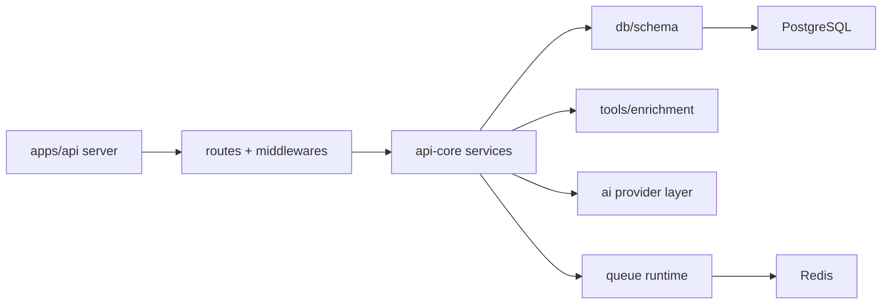

# Modules

> Generated on 2026-04-10

> Last updated: 2026-04-10T10:37:57-03:00
> Repo state: feature/agentic-runtime-openai-sdk @ 499537d

## Overview

`apps/api` is organized as a thin delivery layer, while most modules with business/runtime responsibilities come from `packages/api-core`. For practical maintenance, both sets must be treated as one runtime module graph.

## Module inventory

### server-bootstrap

- **Path:** `apps/api/src/index.ts`, `apps/api/src/server.ts`
- **Responsibility:** app boot lifecycle, middleware wiring, route mounting, cron scheduling, queue dashboard mounting.
- **Key files:**
  - `apps/api/src/index.ts` - process hooks, graceful shutdown, startup bootstrap.
  - `apps/api/src/server.ts` - Hono app assembly.
- **Internal dependencies:** routes, middlewares, api-core services.
- **External dependencies:** Hono, node-cron, Sentry, Bull Board.
- **Public interface:** default Hono app export.

### transport-routes

- **Path:** `apps/api/src/routes/**`
- **Responsibility:** HTTP endpoints for webhooks, items, auth pass-through, dashboard APIs.
- **Key files:**
  - `apps/api/src/routes/webhook-new.ts` - webhook ingestion.
  - `apps/api/src/routes/dashboard/admin.routes.ts` - admin APIs.
- **Internal dependencies:** api-core adapters/services, auth middleware.
- **External dependencies:** zod validator, Hono.
- **Public interface:** mounted route groups under `/webhook`, `/items`, `/api/*`.

### authz-middlewares

- **Path:** `apps/api/src/middlewares/**`
- **Responsibility:** session validation and admin gate.
- **Key files:**
  - `apps/api/src/middlewares/auth.middleware.ts`
  - `apps/api/src/middlewares/admin.middleware.ts`
- **Internal dependencies:** `authPlugin`, `userService`.
- **Public interface:** Hono middleware functions.

### orchestration-core

- **Path:** `packages/api-core/src/services/agent-orchestrator.ts`
- **Responsibility:** deterministic runtime flow, intent-to-action routing, LLM mediation, state transitions.
- **Internal dependencies:** classifier, conversation service, tools, queue service.
- **External dependencies:** AI SDK/OpenAI transport.
- **Public interface:** orchestrator singleton and process entrypoint.

### queue-runtime

- **Path:** `packages/api-core/src/services/queue-service.ts`
- **Responsibility:** queue definitions, workers, retries, delayed closing jobs.
- **Internal dependencies:** message-service, DB, provider factory.
- **External dependencies:** BullMQ, ioredis.
- **Public interface:** queue instances + helper schedulers.

### persistence-and-schema

- **Path:** `packages/api-core/src/db/**`, `packages/api-core/src/db/schema/**`
- **Responsibility:** DB client, typed schema, relationships.
- **Key files:**
  - `packages/api-core/src/db/index.ts`
  - `packages/api-core/src/db/schema/items.ts`
  - `packages/api-core/src/db/schema/conversations.ts`
- **External dependencies:** drizzle-orm, postgres-js.

### tools-and-enrichment

- **Path:** `packages/api-core/src/services/tools/**`, `packages/api-core/src/services/enrichment/**`
- **Responsibility:** strongly-typed tool execution and third-party enrichment.
- **Key files:**
  - `packages/api-core/src/services/tools/index.ts`
  - `packages/api-core/src/services/enrichment/tmdb-service.ts`
- **Notes:** combines synchronous save flow with async enrichment follow-up.

### ai-provider-layer

- **Path:** `packages/api-core/src/services/ai/**`
- **Responsibility:** LLM provider abstraction, embedding generation, manual tool loop runtime.
- **Key files:**
  - `packages/api-core/src/services/ai/index.ts`
  - `packages/api-core/src/services/ai/ai-sdk-provider.ts`

## Dependency graph

## Notes

Could not determine strict boundaries enforced by package-level lint rules for import direction. Directionality is mostly convention-based.
