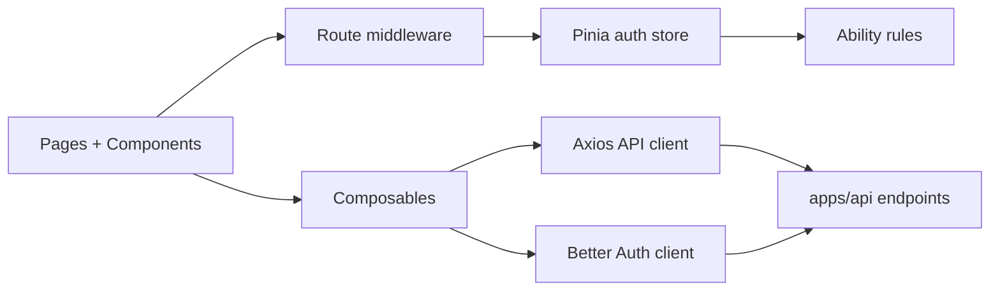

# Architecture

> Generated on 2026-04-10

> Last updated: 2026-04-10T10:37:57-03:00
> Repo state: feature/agentic-runtime-openai-sdk @ 499537d

## Overview

The dashboard architecture is a client-side Nuxt SPA with plugin-based integration for auth and data fetching. It does not own backend domain state; instead, it orchestrates frontend state and view concerns over authenticated API calls.

Routing security is layered: global auth middleware enforces session presence and email verification flow, and role middleware protects admin paths. State and authorization abilities are synchronized through Pinia + CASL.

## System diagram

## Component breakdown

### Nuxt app shell

- **Responsibility:** runtime config, module registration, SPA behavior.
- **Location:** `apps/dashboard/nuxt.config.ts`
- **Communicates with:** plugins, middleware, backend APIs
- **Protocol:** browser runtime + HTTP

### Middleware layer

- **Responsibility:** auth/role guards and navigation control.
- **Location:** `apps/dashboard/app/middleware/*.ts`
- **Communicates with:** auth store, router
- **Protocol:** in-app navigation hooks

### Composables/service adapter

- **Responsibility:** endpoint-level operations for dashboard features.
- **Location:** `apps/dashboard/app/composables/useDashboard.ts`
- **Communicates with:** Axios client and backend `/api/*`.
- **Protocol:** HTTP JSON

### Store and ability

- **Responsibility:** session-derived user state and permission model.
- **Location:** `apps/dashboard/app/stores/auth.ts`, `apps/dashboard/app/plugins/casl.ts`
- **Communicates with:** Better Auth client, API profile endpoint.

## Layers

1. **Presentation:** pages/components/layouts.
2. **Application UI logic:** composables/stores/middleware.
3. **Transport:** Axios and Better Auth clients.
4. **External boundary:** backend API (`apps/api`).

## Cross-cutting concerns

- **Authentication:** Better Auth Vue client plugin + global auth middleware.
- **Authorization:** role middleware + CASL ability updates from store.
- **Error handling:** local catches/toasts and silent warnings in store refresh.
- **Configuration:** runtime config (`public.apiUrl`, `public.authBaseUrl`) from Nuxt.
- **Observability:** optional Vercel analytics package included as dependency.
