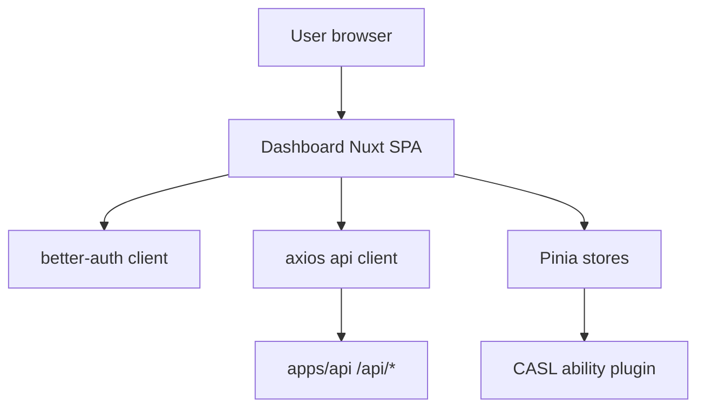

# Dashboard Application Context

> Generated on 2026-04-10

> Auto-generated by Codebase Context Mapper on 2026-04-10
> Last updated: 2026-04-10T10:37:57-03:00
> Source: apps/dashboard
> Repo state: feature/agentic-runtime-openai-sdk @ 499537d

## What is this

`apps/dashboard` is the Nuxt-based administrative/user-facing web console for Nexo AI. It handles login/session UX, profile/preferences management, memory browsing/editing, and admin views (users, sessions, conversations, tools, settings) through authenticated calls to backend endpoints.

## Architecture at a glance

SPA Nuxt frontend (`ssr: false`) with route middleware and composables over Axios/Better Auth clients, consuming `apps/api` endpoints.

## Tech stack summary

- **Language(s):** TypeScript, Vue SFC
- **Framework(s):** Nuxt 4, Vue 3, Pinia, Vue Query
- **Database(s):** none direct (backend-owned)
- **Infrastructure:** Vercel target (vercel.json)
- **Build:** Nuxt build, pnpm workspace scripts

## Quick stats

| Metric | Value |
|--------|-------|
| Modules/packages (app-level areas) | 10 |
| Source files | 260 |
| Test files | 4 |
| Approximate LOC | 14,697 |

## Critical knowledge

1. Dashboard runs with `ssr: false`, so auth/session behavior is client-centric.
2. API base URL is normalized to ensure `/api` suffix in Axios client.
3. Auth middleware blocks protected pages and redirects to login with callback URL.
4. Role middleware enforces admin page access on frontend, but backend still must enforce admin checks.
5. Better Auth client is injected as Nuxt plugin (`$authClient`) and used via composable.
6. CASL ability is updated from auth store role/permissions.
7. Many views consume the same `useDashboard` composable API adapter.
8. Some admin pages still contain TODO placeholders for incomplete actions.

## Context documents

| Document | Description |
|----------|-------------|
| [ARCHITECTURE.md](./ARCHITECTURE.md) | System design, boundaries, topology |
| [TECH_STACK.md](./TECH_STACK.md) | Languages, frameworks, dependencies |
| [DOMAIN_MODEL.md](./DOMAIN_MODEL.md) | Business entities, contexts, data flow |
| [MODULES.md](./MODULES.md) | Module inventory and responsibilities |
| [PATTERNS.md](./PATTERNS.md) | Code patterns and conventions |
| [DATA_LAYER.md](./DATA_LAYER.md) | Databases, ORMs, caching |
| [API_SURFACE.md](./API_SURFACE.md) | APIs, contracts, integrations |
| [TESTING.md](./TESTING.md) | Test strategy and frameworks |
| [BUILD_AND_DEPLOY.md](./BUILD_AND_DEPLOY.md) | CI/CD, build system, environments |
| [TECH_DEBT.md](./TECH_DEBT.md) | Known debt and risk areas |
| [CONVENTIONS.md](./CONVENTIONS.md) | Naming, organization, workflow |
| [GLOSSARY.md](./GLOSSARY.md) | Project-specific terminology |
