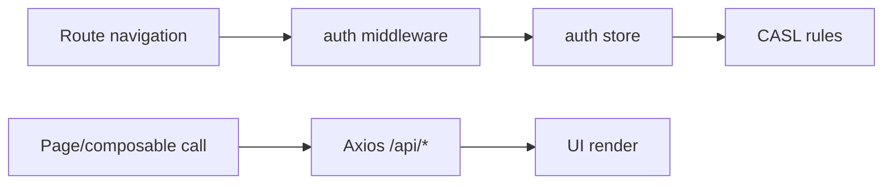

# Domain Model

> Generated on 2026-04-10

> Last updated: 2026-04-10T10:37:57-03:00
> Repo state: feature/agentic-runtime-openai-sdk @ 499537d

## Overview

The dashboard domain is a projection of backend entities into UI workflows. It does not persist domain data directly; instead, it maps API responses into view models for profile, memories, conversations, account linking, feature flags, and admin operations.

Core dashboard behavior is represented by composable methods and store-computed user session context.

## UI-facing entities

| Entity | Role in dashboard | Source |
|---|---|---|
| Auth user | session identity and role | `app/stores/auth.ts` |
| User preferences | editable settings | `app/composables/useDashboard.ts` |
| Memory item | displayed and edited memory entries | `useDashboard.ts` |
| Conversation summary/audit | admin monitoring views | `useDashboard.ts`, admin pages |
| Linked accounts | provider linking status | `useDashboard.ts`, profile pages |
| Feature flags/tools | admin operations | admin pages + API |

## Bounded contexts in frontend

| Context | Main files |
|---|---|
| Authentication/session | `app/plugins/auth.client.ts`, `app/stores/auth.ts`, `middleware/auth.global.ts` |
| User self-service | `app/pages/profile/*`, `app/composables/useDashboard.ts` |
| Memory management | `app/pages/memories.vue`, memory modals/components |
| Admin operations | `app/pages/admin/*`, role middleware |

## Data flow

## Business rules seen in UI layer

1. Unauthenticated users are redirected to `/login` (with callback URL).
2. Authenticated unverified users are redirected to `/confirm-email`.
3. `/admin/*` routes require admin role in middleware.
4. Role-based ability defaults differ between admin and standard users.

## Notes

Could not determine complete backend schema from dashboard alone; entity definitions here are view models and API payload contracts.
