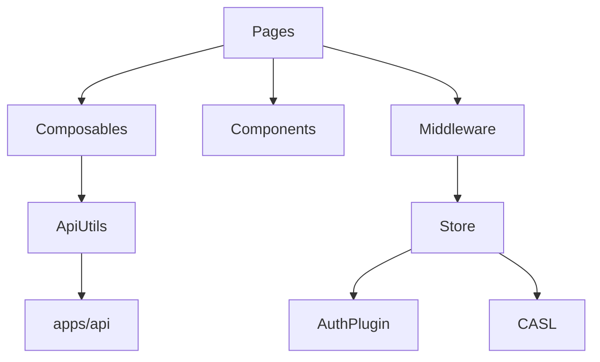

# Modules

> Generated on 2026-04-10

> Last updated: 2026-04-10T10:37:57-03:00
> Repo state: feature/agentic-runtime-openai-sdk @ 499537d

## Overview

Dashboard modules follow standard Nuxt app partitioning under `app/`: pages, components, composables, plugins, middleware, stores, and utils. Most business interaction funnels through one composable service adapter.

## Module inventory

### routing-and-pages

- **Path:** `apps/dashboard/app/pages/**`
- **Responsibility:** route-level feature screens (profile, memories, admin).
- **Key files:** `pages/index.vue`, `pages/memories.vue`, `pages/admin/*.vue`.
- **Dependencies:** composables, stores, Nuxt UI components.

### components-library

- **Path:** `apps/dashboard/app/components/**`
- **Responsibility:** reusable UI units (cards, modals, dashboard widgets).
- **Key files:** `AddMemoryModal.vue`, `EditMemoryModal.vue`, `components/dashboard/*`.

### composables-api-adapter

- **Path:** `apps/dashboard/app/composables/useDashboard.ts`
- **Responsibility:** typed API methods for dashboard actions.
- **Public interface:** exported function returning endpoint operations.

### auth-and-security

- **Path:** plugins + middleware + auth store
- **Key files:**
  - `app/plugins/auth.client.ts`
  - `app/middleware/auth.global.ts`
  - `app/middleware/role.ts`
  - `app/stores/auth.ts`
- **Responsibility:** session, redirect flow, role gating.

### state-and-queries

- **Path:** `app/stores`, `app/plugins/vue-query.ts`
- **Responsibility:** client state and request caching behavior.

### infrastructure-utils

- **Path:** `app/utils/*`, `app/config/env.ts`
- **Responsibility:** API client setup, env fallback handling, helper functions.

## Dependency graph

## Notes

Could not determine a generated typed client from OpenAPI; current API integration is handcrafted composable + Axios usage.
