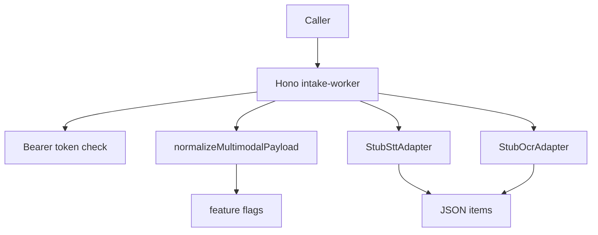

# Intake Worker Application Context

> Generated on 2026-04-10

> Auto-generated by Codebase Context Mapper on 2026-04-10
> Last updated: 2026-04-10T10:37:57-03:00
> Source: apps/intake-worker
> Repo state: feature/agentic-runtime-openai-sdk @ 499537d

## What is this

`apps/intake-worker` is a lightweight Hono microservice that validates and normalizes multimodal attachment payloads (audio/image) and returns extracted textual items. It is designed as a separate processing boundary for intake concerns and currently uses stub OCR/STT adapters.

## Architecture at a glance

Small HTTP worker with token-gated endpoint, shared contract validation (`@nexo/shared`), and adapter-based extraction.

## Tech stack summary

- **Language(s):** TypeScript
- **Framework(s):** Hono
- **Database(s):** none
- **Infrastructure:** standalone Node service
- **Build:** tsup + tsx + vitest

## Quick stats

| Metric | Value |
|--------|-------|
| Modules/packages (app-level areas) | 4 |
| Source files | 10 |
| Test files | 3 |
| Approximate LOC | 606 |

## Critical knowledge

1. `/intake/process` requires bearer token only if `INTAKE_WORKER_TOKEN` is configured.
2. Payload must contain `attachments` array and each item must pass shared schema validation.
3. Feature flags (`MULTIMODAL_AUDIO`, `MULTIMODAL_IMAGE`) can reject payloads with 422.
4. Adapters are stubs; this app is contract-ready but extraction fidelity is placeholder.
5. App has no direct persistence; it returns normalized/extracted payloads only.

## Context documents

| Document | Description |
|----------|-------------|
| [ARCHITECTURE.md](./ARCHITECTURE.md) | System design, boundaries, topology |
| [TECH_STACK.md](./TECH_STACK.md) | Languages, frameworks, dependencies |
| [DOMAIN_MODEL.md](./DOMAIN_MODEL.md) | Business entities, contexts, data flow |
| [MODULES.md](./MODULES.md) | Module inventory and responsibilities |
| [PATTERNS.md](./PATTERNS.md) | Code patterns and conventions |
| [DATA_LAYER.md](./DATA_LAYER.md) | Databases, ORMs, caching |
| [API_SURFACE.md](./API_SURFACE.md) | APIs, contracts, integrations |
| [TESTING.md](./TESTING.md) | Test strategy and frameworks |
| [BUILD_AND_DEPLOY.md](./BUILD_AND_DEPLOY.md) | CI/CD, build system, environments |
| [TECH_DEBT.md](./TECH_DEBT.md) | Known debt and risk areas |
| [CONVENTIONS.md](./CONVENTIONS.md) | Naming, organization, workflow |
| [GLOSSARY.md](./GLOSSARY.md) | Project-specific terminology |
