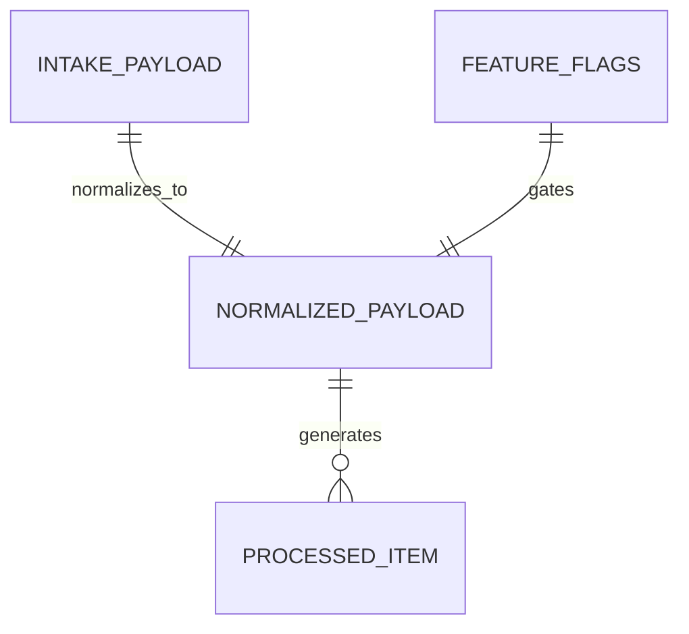

# Domain Model

> Generated on 2026-04-10

> Last updated: 2026-04-10T10:37:57-03:00
> Repo state: feature/agentic-runtime-openai-sdk @ 499537d

## Overview

The intake-worker domain model is contract-driven and centered on multimodal attachments. It validates payload structure, enforces transport constraints (url xor base64), applies feature flags by modality, and returns extracted text items with metadata.

## Core entities

| Entity | Description | Source |
|---|---|---|
| Multimodal intake payload | input attachment contract (`audio` or `image`) | `packages/shared/src/contracts/multimodal-intake.ts` |
| Normalized payload | internal uniform representation with `transport` + `content` | `packages/shared/src/utils/multimodal-normalizer.ts` |
| Worker feature flags | runtime modality gates | `apps/intake-worker/src/config/feature-flags.ts` |
| Processed item | output entry (`kind`, `messageId`, `text`, metadata) | `apps/intake-worker/src/app.ts` |

## Relationship diagram



## Data flow

```mermaid
flowchart TD
  Req[Request with attachments[]] --> Parse[JSON parse]
  Parse --> Validate[Schema + transport validation]
  Validate --> FlagCheck[Audio/Image feature flags]
  FlagCheck --> Extract[STT or OCR adapter]
  Extract --> Items[items[] output]
```

## Rules

1. Exactly one transport is required per attachment (`url` or `base64`).
2. URL transport must use `http` or `https`.
3. Disabled modality flag rejects request with 422.
4. Unauthorized/missing token returns 401 when token is configured.

## Notes

No persistence entities exist in this app. State is request-scoped only.
