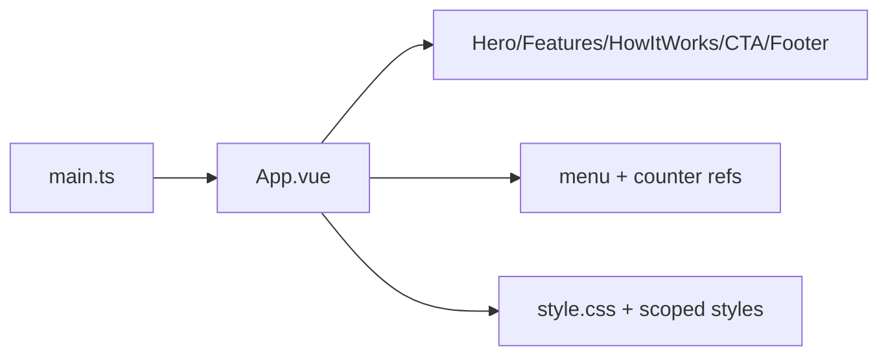

# Architecture

> Generated on 2026-04-10

> Last updated: 2026-04-10T10:37:57-03:00
> Repo state: feature/agentic-runtime-openai-sdk @ 499537d

## Overview

Landing architecture is minimal: Vite bootstraps a Vue app that mounts a single primary component (`App.vue`). The app is content-driven and does not contain a layered service architecture like backend/dashboard apps.

Most UI content is static section blocks with lightweight runtime interactivity.

## System diagram

## Component breakdown

### bootstrap

- **Responsibility:** mount Vue app.
- **Location:** `apps/landing/src/main.ts`

### root page component

- **Responsibility:** full landing layout and local interactions.
- **Location:** `apps/landing/src/App.vue`

### styling layer

- **Responsibility:** global and component styling.
- **Location:** `apps/landing/src/style.css`, `<style>` in `App.vue`

## Layers

1. Entry bootstrap.
2. Root UI component.
3. Static assets/styling.

## Cross-cutting concerns

- **Authentication:** none.
- **Authorization:** none.
- **Logging/Error handling:** none specific.
- **Configuration:** Vite config only (`vite.config.ts`).
