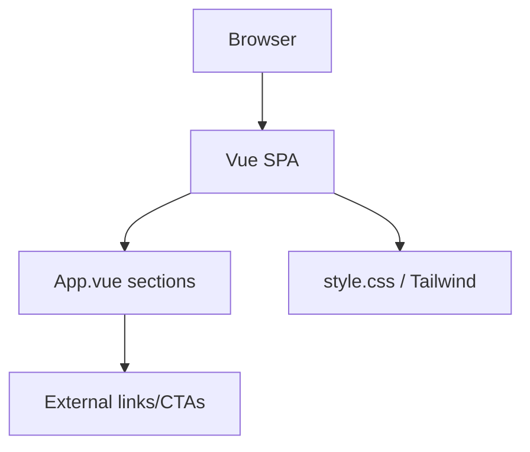

# Landing Application Context

> Generated on 2026-04-10

> Auto-generated by Codebase Context Mapper on 2026-04-10
> Last updated: 2026-04-10T10:37:57-03:00
> Source: apps/landing
> Repo state: feature/agentic-runtime-openai-sdk @ 499537d

## What is this

`apps/landing` is a Vue + Vite marketing site for Nexo AI. It presents product positioning, features, social proof, and CTA entry points for messaging channels and dashboard access.

## Architecture at a glance

Single-page Vue app with static sections and light client-side interactions (menu toggle and animated counter).

## Tech stack summary

- **Language(s):** TypeScript, Vue SFC, CSS
- **Framework(s):** Vue 3 + Vite
- **Database(s):** none
- **Infrastructure:** Vercel static deploy target
- **Build:** `vue-tsc -b && vite build`

## Quick stats

| Metric | Value |
|--------|-------|
| Modules/packages (app-level areas) | 3 |
| Source files | 12 |
| Test files | 0 |
| Approximate LOC | 1,977 |

## Critical knowledge

1. App is mostly static marketing UI; no authenticated business flow.
2. Main logic is concentrated in `src/App.vue`.
3. There are generated-looking JS/DTs artifacts inside `src/` (e.g., `App.vue.js`).
4. No direct backend API client is configured in this app.
5. Build/deploy is Vite-based and wired for Vercel in `vercel.json`.

## Context documents

| Document | Description |
|----------|-------------|
| [ARCHITECTURE.md](./ARCHITECTURE.md) | System design, boundaries, topology |
| [TECH_STACK.md](./TECH_STACK.md) | Languages, frameworks, dependencies |
| [DOMAIN_MODEL.md](./DOMAIN_MODEL.md) | Business entities, contexts, data flow |
| [MODULES.md](./MODULES.md) | Module inventory and responsibilities |
| [PATTERNS.md](./PATTERNS.md) | Code patterns and conventions |
| [DATA_LAYER.md](./DATA_LAYER.md) | Databases, ORMs, caching |
| [API_SURFACE.md](./API_SURFACE.md) | APIs, contracts, integrations |
| [TESTING.md](./TESTING.md) | Test strategy and frameworks |
| [BUILD_AND_DEPLOY.md](./BUILD_AND_DEPLOY.md) | CI/CD, build system, environments |
| [TECH_DEBT.md](./TECH_DEBT.md) | Known debt and risk areas |
| [CONVENTIONS.md](./CONVENTIONS.md) | Naming, organization, workflow |
| [GLOSSARY.md](./GLOSSARY.md) | Project-specific terminology |
