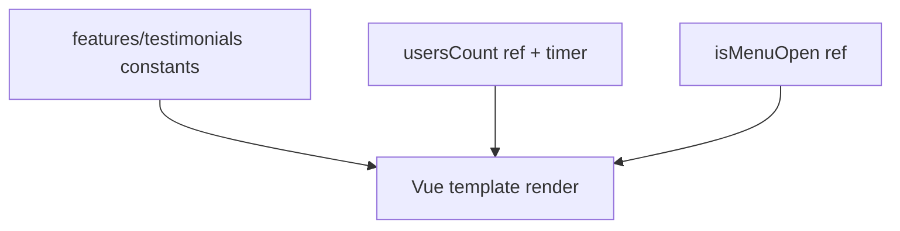

# Domain Model

> Generated on 2026-04-10

> Last updated: 2026-04-10T10:37:57-03:00
> Repo state: feature/agentic-runtime-openai-sdk @ 499537d

## Overview

Landing does not model persistent business entities. Its domain is marketing-content composition: feature cards, testimonials, CTA links, and section ordering.

Data is currently embedded in component-level constants and refs.

## UI entities

| Entity | Representation | Source |
|---|---|---|
| Feature | array of icon/title/description | `apps/landing/src/App.vue` |
| Testimonial | array of user quote metadata | `apps/landing/src/App.vue` |
| CTA links | static URLs (WhatsApp/Telegram/Discord placeholders) | `apps/landing/src/App.vue` |
| Animated counter | `usersCount` reactive ref | `apps/landing/src/App.vue` |

## Data flow

## Rules observed

1. Counter animation increments to a fixed target.
2. Mobile menu toggles visibility via local ref state.
3. CTA links are currently hardcoded placeholders in template.

## Notes

Could not determine CMS/content pipeline integration from code; content is hardcoded in component.
