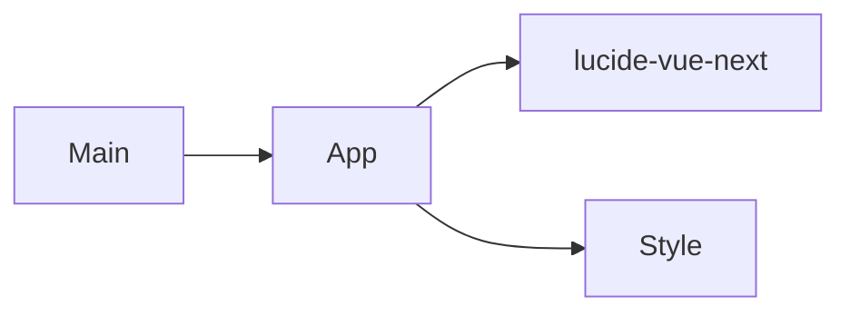

# Modules

> Generated on 2026-04-10

> Last updated: 2026-04-10T10:37:57-03:00
> Repo state: feature/agentic-runtime-openai-sdk @ 499537d

## Overview

Landing has a flat module structure centered on one main Vue SFC and bootstrap files.

## Module inventory

### bootstrap

- **Path:** `apps/landing/src/main.ts`
- **Responsibility:** app mounting.
- **Public interface:** none (entrypoint only).

### root-ui

- **Path:** `apps/landing/src/App.vue`
- **Responsibility:** complete landing content and interaction behavior.
- **Dependencies:** Vue refs/lifecycle, icon components.

### styles

- **Path:** `apps/landing/src/style.css`
- **Responsibility:** global style setup for landing app.

## Dependency graph

## Notes

Generated artifact files (`App.vue.js`, `*.d.ts`, `*.map`) are present in `src/`, which is unusual for hand-maintained source folders.
