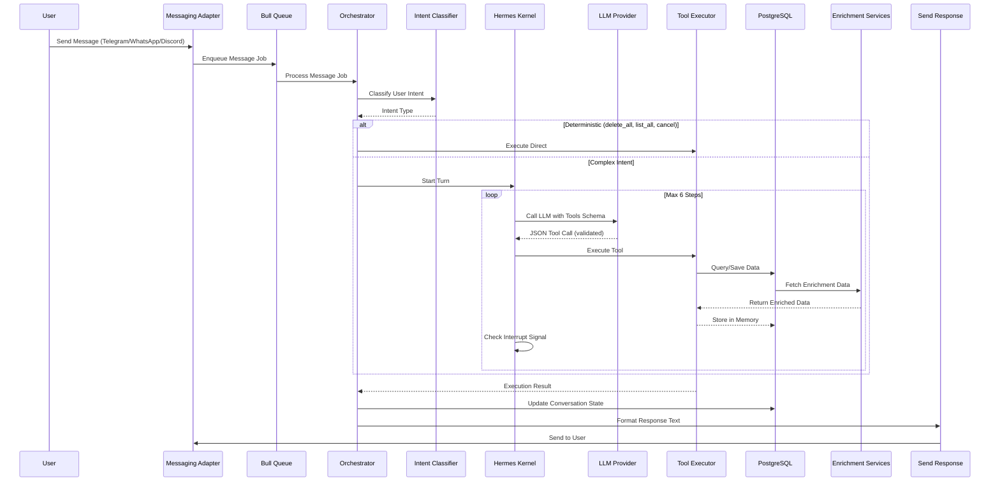

# API Architecture

> Generated: May 9, 2026 | Branch: development | Commit: 07478fe

## Overview

The Nexo API is built on a deterministic agent orchestration model where the runtime (Hermes kernel) controls all execution flow. The LLM is never trusted to make decisions; instead, it generates JSON-formatted tool calls that are strictly validated before execution. This design ensures reproducibility, safety, and predictability even when using different LLM providers.

The architecture separates concerns into distinct layers:

1. **Messaging Layer** — Webhooks from Telegram, WhatsApp (via Evolution API), and Discord routes to adapters
2. **Request Processing** — HTTP routes handle authentication, validation, and request dispatch
3. **Core Runtime** — Hermes kernel executes deterministic agentic flows
4. **Persistence** — PostgreSQL stores all state; Redis handles caching and job queues
5. **Enrichment** — Third-party APIs (TMDB, YouTube, Spotify, etc.) enrich user queries

## System flow: Message to Response



## Component breakdown

### 1. Messaging Adapters (`channels/`)

Each adapter bridges a messaging platform to the unified webhook handler.

| Adapter | File | Protocol | Webhook Path |
|---------|------|----------|--------------|
| **Telegram** | `channels/telegram/` | Polling/Webhook | `/webhook/telegram` |
| **WhatsApp** | `routes/webhook/whatsapp.ts` | Evolution API webhooks | `/webhook/whatsapp` |
| **Discord** | `routes/discord.ts` | Discord Bot events | `/discord/interactions` |

Each adapter normalizes platform-specific message format into a common `MessageInput` type.

### 2. Request Router (`routes/`)

HTTP routes handle incoming requests and dispatch to appropriate handlers:

```ts
// routes/index.ts
registerHealthRoutes(app);           // /health
registerMemoryRoutes(app);           // /memories (search, save, list)
registerConversationRoutes(app);     // /conversations (state)
registerAccountRoutes(app);          // /accounts (user management)
registerTelegramWebhook(app);        // /webhook/telegram
registerWhatsAppSettingsRoutes(app); // /whatsapp-settings
registerDiscordRoutes(app);          // /discord
```

### 3. Agent Orchestrator (`services/agent-orchestrator.ts`)

Determines the execution path based on intent:

- **Deterministic actions** → Execute directly (no LLM)
  - `delete_all` — Remove all memories
  - `list_all` — List all memories
  - `cancel` — Stop current operation

- **Complex actions** → Route to LLM planner

```ts
const classification = await intentClassifier.classify(userMessage);

if (classification.type === 'deterministic') {
  return executeDeterministic(classification.action);
} else {
  return await kernel.runTurn({ userMessage, systemPrompt });
}
```

### 4. Intent Classifier (`services/intent-classifier.ts`)

Uses Cloudflare AI gateway to classify user intent into action types:

```ts
// Calls Cloudflare Workers AI model
const response = await classify(userMessage, conversationContext);
// Returns: { type: 'deterministic' | 'complex', action?: string, confidence: number }
```

### 5. Hermes Kernel (`core/kernel/hermes-kernel.ts`)

The deterministic agent loop. Executes max 6 turns:

```ts
async runTurn(input: { 
  sessionKey: string
  userMessage: string
  systemPrompt: string
}, callbacks?, interrupt?): Promise<{ text: string }> {
  for (let step = 0; step < 6; step++) {
    // Build tool schema from registry
    const catalog = await toolRegistry.buildHermesToolCatalog();
    
    // Call LLM with strict contract
    const next = await modelTurnRunner.next({ ...input, tools: toolSchemas });
    // next: { toolName, input, response }
    
    // Validate tool exists and execute
    const result = await executeToolWithPolicy(next);
    
    // Update input for next turn
    input.systemPrompt = `${input.systemPrompt}\nTool result: ${result}`;
  }
  return { text: finalResponse };
}
```

### 6. Tool Registry (`core/registries/tool-registry.ts`)

Maintains available tools and validates execution:

```ts
// Tools are registered statically
const toolRegistry = new PostgresToolRegistry();
const catalog = await toolRegistry.buildHermesToolCatalog();
// catalog: [ { name, description, jsonSchema, handler } ]
```

Available tools: `save_memory`, `search_memory`, `enrich_movie`, `enrich_book`, etc.

### 7. Model Runner (`core/model/credential-pool.ts` + `model-turn-runner.ts`)

Abstracts LLM provider selection and handles multi-provider support:

```ts
// core/model/credential-pool.ts
class CredentialPool {
  getForModel(modelName: string): LLMProvider {
    // Returns registered provider (Cloudflare default, fallback to Gemini/Claude)
  }
}

// core/model/model-turn-runner.ts
async next(input: { 
  sessionKey: string
  userMessage: string
  systemPrompt: string
  tools: ToolSchema[]
}): Promise<AgentLLMResponse> {
  const provider = credentialPool.getForModel(this.preferredModel);
  return provider.generateResponse(input);
}
```

### 8. Persistence Layer (`db/`)

Drizzle ORM manages PostgreSQL interactions:

```ts
// apps/api/src/db/index.ts
export const db = drizzle(connectionPool);

// Usage in services
const user = await db.select().from(users).where(eq(users.id, userId));
```

Key tables: `users`, `conversations`, `memory_items`, `messages`, `sessions`, `semantic_external_items`, `agent_skills`

### 9. Memory Registry (`core/registries/memory-registry.ts`)

Handles semantic memory search with embeddings:

```ts
class PostgresMemoryRegistry {
  async search(query: string, userId: string): Promise<MemoryItem[]> {
    // 1. Generate embedding for query (Cloudflare)
    const embedding = await generateEmbedding(query);
    
    // 2. Hybrid search: keyword + semantic
    const results = await db
      .select()
      .from(memoryItems)
      .where(...)
      .orderBy(similarityScore)
      .limit(10);
    
    return results;
  }
}
```

### 10. Enrichment Services (`core/enrichment/`)

Integrate with external APIs:

| Service | Module | Purpose |
|---------|--------|---------|
| **TMDB** | `tmdb-service.ts` | Movie/TV metadata, ratings, where to watch |
| **YouTube** | `youtube-service.ts` | Video search, metadata |
| **Spotify** | `spotify-service.ts` | Track/album/artist info |
| **Google Books** | `books-service.ts` | Book metadata, preview links |
| **Brave Search** | `brave-search-service.ts` | Web search results |
| **Open Graph** | `open-graph-service.ts` | Link preview (title, image, description) |

## Layers and concerns

### Presentation Layer
- HTTP routes (`routes/`)
- Webhook handlers (`routes/webhook/`)
- Response formatting

### Application Layer
- Agent orchestrator (`services/agent-orchestrator.ts`)
- Intent classifier (`services/intent-classifier.ts`)
- Conversation service (`services/conversation-service.ts`)
- Route-level request handling

### Domain Layer
- Hermes kernel (`core/kernel/`)
- Tool registry (`core/registries/tool-registry.ts`)
- Memory registry (`core/registries/memory-registry.ts`)
- Enrichment services (`core/enrichment/`)

### Persistence Layer
- Drizzle ORM (`db/`)
- Database schema (`db/schema/`)
- Migrations (`drizzle/`)

### Cross-cutting Concerns
- **Observability:** Sentry + OpenTelemetry (`sentry.ts`, `otel/`)
- **Configuration:** Environment validation (`config/env.ts`)
- **Logging:** Pino logger wrapper (`utils/logger.ts`)
- **Error handling:** Global error handler, HTTP exception mapping

## Cross-cutting concerns

### Authentication & Authorization

Better-Auth 1.4 handles session management:

```ts
// routes/accounts.ts
const session = await getSession(req); // From Better-Auth
if (!session) return c.json({ error: 'Unauthorized' }, 401);

// CASL abilities are scoped by user role
```

### Logging

Centralized logger with context:

```ts
// utils/logger.ts
export const logger = pino({ level: process.env.LOG_LEVEL || 'info' });

// Usage
logger.info({ userId, action: 'memory_saved' }, 'Memory created');
logger.error({ error, conversationId }, 'Conversation failed');
```

### Error Handling

Global error handler maps exceptions to HTTP responses:

```ts
// server.ts
app.onError(async (error, c) => {
  if (error instanceof HTTPException) {
    return c.json({ error: error.message }, error.status);
  }
  
  // Unexpected errors → 500 + Sentry
  await captureException(error);
  return c.json({ error: 'Internal server error' }, 500);
});
```

### Configuration

Environment variables validated at startup via Zod:

```ts
// config/env.ts
const envSchema = z.object({
  NODE_ENV: z.enum(['development', 'production']),
  DATABASE_URL: z.string().url(),
  REDIS_HOST: z.string(),
  // ... 50+ variables
});

export function getApiEnv() {
  return envSchema.parse(process.env);
}
```

## Data flow: Message → Memory

1. **User sends message** via Telegram/WhatsApp/Discord
2. **Adapter normalizes** to common format, enqueues to Bull
3. **Orchestrator classifies** intent (deterministic vs. complex)
4. **Kernel executes** tools in loop (max 6 steps)
5. **Tool executor** calls enrichment services if needed
6. **Enrichment** fetches external data (TMDB, YouTube, etc.)
7. **Database persists** memory item with metadata + embedding
8. **Response formatter** generates text response
9. **Adapter sends** response back to user

## Deployment model

The API is containerized and runs on:

- **Local:** `tsx watch` with nodemon
- **Docker:** Multi-stage build in `apps/api/Dockerfile`
- **Production:** Railway or Vercel (serverless)

Key environment requirements:

- PostgreSQL 15+ with Drizzle migrations applied
- Redis 7+ for queues and caching
- Cloudflare API token for AI gateway
- Third-party API keys (TMDB, YouTube, Spotify, etc.)
- Better-Auth OAuth provider credentials

---

**See also:** [MODULES.md](./MODULES.md), [DATA_LAYER.md](./DATA_LAYER.md)
