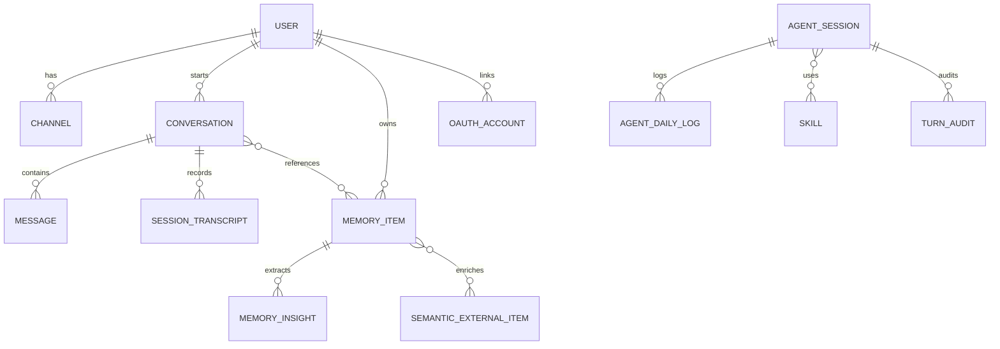

# API Domain Model

> Generated: May 9, 2026 | Branch: development | Commit: 07478fe

## Overview

The Nexo domain model centers on **users**, **conversations**, and **memory items**. Users interact with the system via messaging channels (Telegram, WhatsApp, Discord), initiating conversations where the agent assists with content discovery and management. Memory items are the core artifact—saved references to movies, shows, videos, links, or notes that are enriched with metadata and made searchable via embeddings.

## Core entities

### User

Represents a human user of the system.

**Attributes:**
- `id` (UUID) — Unique identifier
- `email` (string) — Email address (unique)
- `name` (string) — Display name
- `createdAt` (timestamp) — Account creation time
- `preferences` (JSON) — Theme, language, notification settings
- `isAdmin` (boolean) — Administrative flag

**Relationships:**
- Has many `Channels` (Telegram, WhatsApp, Discord)
- Has many `Conversations`
- Has many `MemoryItems`
- Has one `OAuthAccount` per provider (Google, GitHub)

**Invariants:**
- Email is globally unique
- At least one channel connection required to send/receive messages
- User cannot delete own account if admin

---

### Channel

Represents a user's connection to a messaging platform.

**Attributes:**
- `userId` (UUID) — Owner
- `type` (enum) — 'telegram' | 'whatsapp' | 'discord'
- `channelId` (string) — Platform-specific user ID
- `metadata` (JSON) — Platform-specific data (username, phone, etc.)
- `connectedAt` (timestamp)
- `lastMessageAt` (timestamp) — Last activity

**Relationships:**
- Belongs to `User`
- Has many `Messages` (incoming from this channel)

**Invariants:**
- `(type, channelId)` is globally unique (prevent duplicate connections)
- Each channel has a single owner (no sharing)

---

### Conversation

Represents an interaction session between user and bot.

**Attributes:**
- `id` (UUID)
- `userId` (UUID) — Owner
- `state` (enum) — 'active' | 'closed'
- `context` (JSON) — Session context including:
  - `memoryIds: string[]` — Referenced memories
  - `lastIntent: string` — Most recent classified intent
  - `searchQuery: string` — Current search if applicable
  - `enrichmentCache: object` — Cached external data
  - `turnCount: number` — Kernel turns executed
- `createdAt` (timestamp)
- `updatedAt` (timestamp)

**Relationships:**
- Belongs to `User`
- Has many `Messages`
- Has one `SessionTranscript`
- References many `MemoryItems` (via context)

**Invariants:**
- User can only access own conversations
- Closed conversations are read-only
- Context is immutable after state='closed'

---

### Message

Represents a single message in a conversation.

**Attributes:**
- `id` (UUID)
- `conversationId` (UUID)
- `author` (enum) — 'user' | 'bot'
- `content` (string) — Message text
- `role` (enum) — 'user' | 'assistant' | 'system' (for LLM history)
- `metadata` (JSON) — Optional: tool call info, embeddings, etc.
- `createdAt` (timestamp)

**Relationships:**
- Belongs to `Conversation`

**Invariants:**
- Messages are append-only (never updated)
- Author determines role (user messages always have role='user')

---

### Memory Item

Core artifact—user-saved content reference.

**Attributes:**
- `id` (UUID)
- `userId` (UUID) — Owner
- `type` (enum) — 'movie' | 'tv' | 'video' | 'note' | 'link'
- `title` (string) — Human-readable title
- `description` (string) — Summary or notes
- `metadata` (JSON) — Type-specific data:
  - **movie/tv:** `{ imdb_id, tmdb_id, rating, year, genres }`
  - **video:** `{ youtube_id, duration, channel }`
  - **link:** `{ url, domain, favicon_url }`
  - **note:** `{ source, tags, category }`
- `embedding` (vector) — 384-dim embedding for semantic search
- `tags` (array) — User-assigned labels
- `createdAt` (timestamp)
- `deletedAt` (timestamp, nullable) — Soft delete flag

**Relationships:**
- Belongs to `User`
- May reference `SemanticExternalItem` (for enriched data)
- Has many `MemoryInsights`

**Invariants:**
- Title is required
- Type determines valid metadata shape
- Embedding is regenerated on update
- Deleted items are hidden but retained (audit trail)

---

### SemanticExternalItem

Cache of external entities (movies, videos, books) to avoid redundant enrichment calls.

**Attributes:**
- `id` (UUID)
- `externalId` (string) — Platform-specific ID (e.g., TMDB ID)
- `source` (enum) — 'tmdb' | 'youtube' | 'spotify' | 'google_books'
- `metadata` (JSON) — Full enriched data from source
- `embedding` (vector) — Semantic embedding
- `lastUpdated` (timestamp)
- `cachedAt` (timestamp)

**Relationships:**
- Referenced by many `MemoryItems`

**Invariants:**
- `(source, externalId)` is globally unique
- Cache TTL: 30 days (refresh on access if older)

---

### Skill

Reusable agentic skill (extensibility mechanism).

**Attributes:**
- `id` (UUID)
- `name` (string, unique) — Identifier
- `description` (string) — What the skill does
- `content` (JSON) — Skill logic:
  - `prompt` (string) — System prompt for LLM
  - `examples` (array) — Few-shot examples
  - `tools` (array) — Available tools
- `triggers` (array) — Keywords/intents that activate skill
- `enabled` (boolean)
- `createdAt` (timestamp)
- `updatedAt` (timestamp)

**Relationships:**
- Used by `AgentSession`

**Invariants:**
- Disabled skills are excluded from kernel execution
- Skill changes take effect on next turn (no hot reload)

---

## Domain relationships



## Data flow through a message

```
1. User sends message via Telegram/WhatsApp/Discord
   ↓
2. Adapter creates Channel entry (if new), records Message
   ↓
3. Conversation state retrieved or created
   ↓
4. Intent classified (via Cloudflare AI)
   ↓
5. Kernel runs (max 6 turns)
   ├─ Calls LLM with current Conversation.context
   ├─ LLM returns tool invocation (JSON)
   ├─ Tool executor validates tool exists in MemoryItems/Enrichment
   ├─ Tool enriches (fetches from TMDB, YouTube, etc.) → SemanticExternalItem cached
   ├─ Tool saves MemoryItem with embedding (Cloudflare AI generated)
   └─ Updates Conversation.context with results
   ↓
6. Bot response formatted
   ↓
7. Response sent back via Adapter
   ↓
8. Messages + SessionTranscript updated
```

## Content types (Memory Item types)

### Movie/TV
```json
{
  "type": "movie",
  "title": "Inception",
  "metadata": {
    "imdb_id": "tt1375666",
    "tmdb_id": 27205,
    "rating": 8.8,
    "year": 2010,
    "genres": ["sci-fi", "thriller"],
    "director": "Christopher Nolan",
    "where_to_watch": ["Netflix", "Amazon Prime"]
  }
}
```

### Video
```json
{
  "type": "video",
  "title": "How to use Nexo AI",
  "metadata": {
    "youtube_id": "dQw4w9WgXcQ",
    "duration": 300,
    "channel": "Nexo AI Official",
    "url": "https://youtube.com/watch?v=..."
  }
}
```

### Link
```json
{
  "type": "link",
  "title": "TypeScript Handbook",
  "metadata": {
    "url": "https://www.typescriptlang.org/docs/",
    "domain": "typescriptlang.org",
    "favicon_url": "...",
    "description": "The official TypeScript documentation"
  }
}
```

### Note
```json
{
  "type": "note",
  "title": "TypeScript Tips",
  "description": "Remember to use const instead of let...",
  "metadata": {
    "category": "learning",
    "source": "telegram",
    "is_public": false
  }
}
```

## Bounded contexts

### User & Auth Context
Manages identity, session, OAuth provider links.

- Entities: `User`, `OAuthAccount`, `Channel`
- Commands: Register, Login (OAuth), LinkChannel, UpdatePreferences
- Events: UserCreated, ChannelLinked, PreferencesChanged

### Conversation Context
Manages agentic sessions and message history.

- Entities: `Conversation`, `Message`, `SessionTranscript`
- Commands: CreateConversation, AddMessage, CloseConversation
- Events: ConversationStarted, MessageAdded, ConversationClosed

### Memory Context
Manages user-saved content and semantic search.

- Entities: `MemoryItem`, `SemanticExternalItem`, `MemoryInsight`
- Commands: SaveMemory, SearchMemory, DeleteMemory, EnrichMemory
- Events: MemorySaved, MemorySearched, MemoryEnriched

### Agent Context
Manages skill execution and observability.

- Entities: `AgentSession`, `Skill`, `TurnAudit`
- Commands: ExecuteSkill, LogTurn, InterruptAgent
- Events: SkillExecuted, TurnCompleted, InterruptionRequested

## Invariants & constraints

### User-level
- Email must be unique globally
- At least one channel required for interaction
- User cannot be deleted while owning active conversations

### Conversation-level
- User can only access own conversations
- Closed conversations are read-only
- Context JSONB must be valid JSON

### Memory-level
- Title cannot be empty
- Type determines valid metadata shape
- Embedding must be 384-dim vector
- Semantic search requires embedding

### Auth-level
- OAuth account links are per-provider (one Google, one GitHub per user)
- Session tokens expire after 7 days
- Magic Link tokens expire after 15 minutes

---

**See also:** [ARCHITECTURE.md](./ARCHITECTURE.md), [DATA_LAYER.md](./DATA_LAYER.md)
