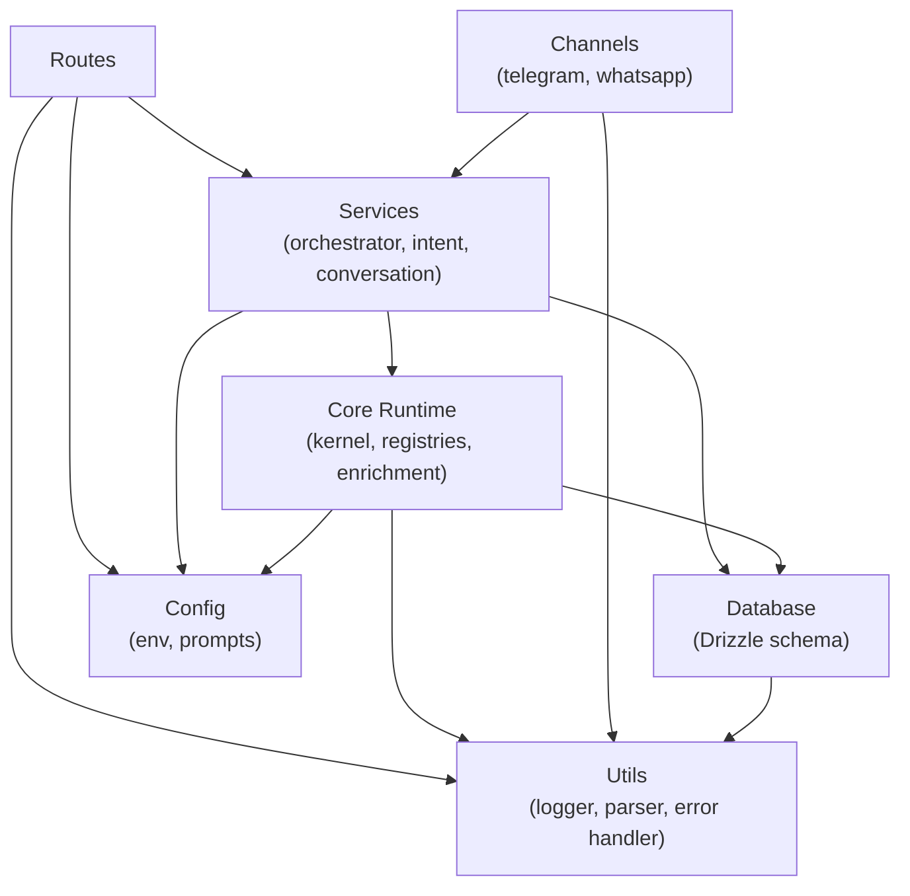

# API Modules

> Generated: May 9, 2026 | Branch: development | Commit: 07478fe

## Overview

The API is organized into 12 core modules, each with a specific responsibility. The module structure follows the pattern: **adapters → routes → services → domain → persistence**. External integration (enrichment services, AI providers) are isolated in dedicated modules and called via registry patterns, not directly imported.

Modules communicate via dependency injection and registered singletons. Cross-module imports use the `@/` path alias (`apps/api/tsconfig.json`).

## Module inventory

### 1. Channels (`src/channels/`)

**Responsibility:** Bridge messaging platforms (Telegram, WhatsApp, Discord) to the unified message processing pipeline.

**Key files:**
- `telegram/bot.ts` — Grammy bot instance, poll/webhook setup
- `telegram/handlers.ts` — Message and callback query handlers
- `whatsapp/` — Evolution API webhook integration

**Internal dependencies:** `routes/`, `services/agent-orchestrator`, `db/`

**External dependencies:** Grammy (Telegram), Discord.js, Evolution API client

**Public interface:**
- `initBot({ botToken })` — Initialize and start Telegram bot
- `handleWhatsAppWebhook(message)` — Process WhatsApp webhook event

**Notes:** 
- Telegram uses Grammy polling in dev, webhooks in production
- WhatsApp uses Evolution API (third-party WhatsApp gateway)
- Discord integration is minimal (placeholder)

---

### 2. Config (`src/config/`)

**Responsibility:** Centralize environment variables, prompts, and configuration loading.

**Key files:**
- `env.ts` — Zod schema for all 50+ environment variables; exports `getApiEnv()`
- `prompts.ts` — Centralized LLM system prompts; do NOT scatter prompts in services

**Internal dependencies:** `@nexo/env` package

**External dependencies:** Zod (validation)

**Public interface:**
- `getApiEnv(): ApiEnv` — Returns validated environment config
- `SYSTEM_PROMPTS` — Object with keys for each intent type

**Notes:**
- All environment variables validated at startup
- Prompts are versioned; update in one place to avoid divergence
- Dev loads `.env` from monorepo root via dotenv

---

### 3. Core Runtime (`src/core/`)

**Responsibility:** Host the deterministic agent orchestration logic. This is the heart of the system.

**Submodules:**

#### 3a. Kernel (`src/core/kernel/`)

Implements the Hermes kernel—deterministic LLM loop with strict tool validation.

- `hermes-kernel.ts` — Main kernel class, `runTurn()` method (max 6 steps)
- `model-turn-runner.ts` — LLM integration point
- `tool-executor.ts` — Tool invocation with policy enforcement

**Pattern:** Kernel receives validated LLM output, checks tool exists, executes with policy, updates prompt, loops.

#### 3b. Model (`src/core/model/`)

Abstract LLM providers and manage credentials.

- `credential-pool.ts` — Registry of LLM providers (Gemini, Claude, LM Studio, Cloudflare)
- `default-model-turn-runner.ts` — Default implementation using registered provider
- `types.ts` — `LLMProvider` interface, `AgentLLMResponse` contract

**Pattern:** Model runner calls provider via credential pool. Supports fallback to default provider.

#### 3c. Registries (`src/core/registries/`)

Maintain stateful registries for tools, memory, and sessions.

- `tool-registry.ts` — PostgreSQL-backed registry of available tools
- `memory-registry.ts` — Semantic search with embeddings
- `session-registry.ts` — Conversation session state management

**Pattern:** Each registry is a singleton, lazily initialized.

#### 3d. Enrichment (`src/core/enrichment/`)

Call external APIs to enrich user queries.

- `tmdb-service.ts` — Movie/TV metadata
- `youtube-service.ts` — Video search
- `spotify-service.ts` — Music metadata
- `books-service.ts` — Book metadata
- `brave-search-service.ts` — Web search
- `open-graph-service.ts` — Link previews

**Public interface:** Each service exports `async enrich(query): Promise<EnrichedData>`

#### 3e. Memory (`src/core/memory/`)

Manage memory item lifecycle and embeddings.

- `memory-service.ts` — Save, retrieve, delete memory items
- `embedding-service.ts` — Generate embeddings via Cloudflare

#### 3f. Gateway (`src/core/gateway/`)

Cloudflare AI gateway integration for embeddings and model routing.

- `cloudflare-gateway.ts` — Gateway API client

#### 3g. Skills (`src/core/skills/`)

Skill system for extensibility.

- `skill-loader.ts` — Load enabled skills from DB
- `skill-executor.ts` — Execute skill logic

#### 3h. Jobs (`src/core/jobs/`)

Job definitions for Bull queue.

- `message-processing-job.ts` — Main job for processing incoming messages

#### 3i. Policies (`src/core/policies/`)

Tool execution policies (validation, rate limiting, safety checks).

- `policy-enforcer.ts` — Check policies before tool execution

#### 3j. Observability (`src/core/observability/`)

Audit trail and telemetry.

- `turn-audit.ts` — Log each kernel turn for debugging
- `breadcrumb-tracker.ts` — Sentry breadcrumbs

#### 3k. Context (`src/core/context/`)

Build execution context for LLM.

- `context-assembler.ts` — Assemble system prompt, conversation history, skills, memories
- `memory-formatter.ts` — Format retrieved memories for prompt injection

#### 3l. Contracts (`src/core/contracts/`)

Strict TypeScript types for runtime contracts.

- `agent-llm-response.ts` — Tool invocation response schema
- `runtime-error.ts` — Runtime error types

---

### 4. Database (`src/db/`)

**Responsibility:** ORM layer and schema definitions.

**Key files:**
- `index.ts` — Drizzle client export `db`
- `schema/` — 30+ table definitions (see `DATA_LAYER.md`)
- `seed/` — Seed scripts for initial data

**Internal dependencies:** None

**External dependencies:** Drizzle ORM, PostgreSQL

**Public interface:**
- `export const db` — Drizzle client
- Schema exports: `users`, `conversations`, `memoryItems`, `messages`, etc.

**Notes:** All schema definitions use TypeScript enums and strict Zod types for JSONB columns.

---

### 5. Routes (`src/routes/`)

**Responsibility:** HTTP request handlers and route registration.

**Key files:**
- `index.ts` — Route registration orchestrator
- `health.ts` — `/health`, `/readiness` endpoints
- `memories.ts` — `/memories` GET/POST/DELETE endpoints
- `conversations.ts` — `/conversations` endpoints
- `accounts.ts` — `/accounts` user management endpoints
- `preferences.ts` — `/preferences` user preferences
- `webhook/telegram.ts` — `/webhook/telegram` Telegram webhook handler
- `discord.ts` — `/discord` Discord interactions

**Internal dependencies:** `services/`, `db/`, `core/`

**External dependencies:** Hono

**Public interface:**
- `registerRoutes(app: Hono)` — Called once at startup

**Notes:** Each route handler validates input, calls service layer, returns response. No business logic in routes.

---

### 6. Services (`src/services/`)

**Responsibility:** High-level business logic orchestration.

**Key files:**
- `agent-orchestrator.ts` — Route user message to deterministic or LLM path
- `intent-classifier.ts` — Classify user intent using Cloudflare AI
- `conversation-service.ts` — Manage conversation state transitions
- `enrichment/` — Submodules for each enrichment service

**Internal dependencies:** `core/`, `db/`

**External dependencies:** AI providers

**Public interface:** Each service exports async functions, e.g. `orchestrate(userId, message, context)`

**Notes:** Services are singletons, injected into route handlers.

---

### 7. Types (`src/types/`)

**Responsibility:** Global TypeScript type definitions.

**Key files:**
- `index.ts` — Common types (`User`, `Conversation`, `MemoryItem`, etc.)

**Notes:** Domain-specific types are co-located with modules; global types here.

---

### 8. Utils (`src/utils/`)

**Responsibility:** Utility functions and helpers.

**Key files:**
- `logger.ts` — Pino logger wrapper with context
- `json-parser.ts` — Safe JSON parsing with fallback
- `error-handler.ts` — Error formatting for responses

**Public interface:** Each export is a function or constant, e.g. `logger.info()`, `parseJson()`

---

### 9. Tests (`src/tests/`)

**Responsibility:** Test files (currently minimal).

**Key files:**
- `intent-classifier.test.ts` — Intent classification tests
- `prompt-architecture-guard.test.ts` — Validate prompt schema

**Notes:** Test coverage is low. Consider expanding with vitest fixtures for services.

---

## Dependency graph



## Module statistics

| Module | Files | Purpose |
|--------|-------|---------|
| **channels/** | 3 | Messaging adapters |
| **config/** | 2 | Environment + prompts |
| **core/** | 40+ | Orchestration (largest, most critical) |
| **db/** | 32 | Schema + migrations |
| **routes/** | 10 | HTTP handlers |
| **services/** | 8 | Business logic |
| **types/** | 1 | Global types |
| **utils/** | 3 | Helpers |
| **tests/** | 2 | Test files |

## Patterns and conventions

### Singleton Pattern

Services are instantiated once and reused:

```ts
// core/registries/tool-registry.ts
const toolRegistry = new PostgresToolRegistry();
// Exported as singleton, never re-instantiated
```

### Dependency Injection

Route handlers receive dependencies via parameters:

```ts
// routes/memories.ts
export function registerMemoryRoutes(app: Hono) {
  app.get('/memories', async (c) => {
    const memoryRegistry = new PostgresMemoryRegistry(); // Or injected
    return c.json(await memoryRegistry.search(...));
  });
}
```

### Registry Pattern

Tools, memory, sessions are managed via registries (not direct DB calls):

```ts
const toolRegistry = await deps.toolRegistry.buildHermesToolCatalog();
// Catalog is built from DB, cached, validated
```

---

**See also:** [ARCHITECTURE.md](./ARCHITECTURE.md), [DATA_LAYER.md](./DATA_LAYER.md)
