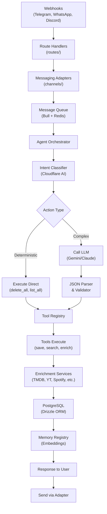

# Nexo API — Codebase Context

> Generated: May 9, 2026 | Branch: development | Commit: 07478fe

## What is this

The Nexo API (`@nexo/api`) is the core runtime server for the Nexo AI system. It's a Node.js + Hono server that orchestrates messaging adapters (Telegram, WhatsApp, Discord), runs the Hermes deterministic agent runtime, manages conversation state, and integrates with multiple AI providers and external enrichment services. The API handles webhook events from messaging platforms, classifies intent, executes tools, and persists memory to PostgreSQL.

## Architecture at a glance

The API follows a **request → adapter → orchestrator → kernel → tools → database** flow. Determinism is achieved by validating all LLM outputs against strict JSON schemas before execution. The system supports multi-provider AI backends, semantic memory search with embeddings, and skill-based extensibility.



## Tech stack summary

| Category | Details |
|----------|---------|
| **Runtime** | Node.js (ESM), TypeScript 5.x, Hono 4.x |
| **Build** | tsup (bundler), tsx (dev runner) |
| **Database** | PostgreSQL 15+, Drizzle ORM 0.45, Migrations |
| **Caching/Queue** | Redis 7+, Bull 5.70, BullMQ |
| **Auth** | Better-Auth 1.4 (OAuth, Magic Link) |
| **AI/LLM** | Cloudflare AI Gateway, Google Gemini, Claude, LM Studio |
| **Messaging** | Grammy (Telegram), Evolution API (WhatsApp), Discord.js |
| **Enrichment APIs** | TMDB, YouTube, Spotify, Google Books, Brave Search, Open Graph |
| **Observability** | Sentry 10.39, OpenTelemetry |
| **Testing** | Vitest, Playwright (E2E) |
| **Format/Lint** | Biome 1.9.4 |

## Quick stats

| Metric | Value |
|--------|-------|
| **Source files** | 99 TypeScript files |
| **Lines of code** | ~5,400 |
| **Core modules** | 12 (channels, config, core, db, routes, utils, etc.) |
| **Database tables** | 30+ (users, conversations, memory_items, auth, skills, etc.) |
| **Migrations** | 20+ Drizzle migrations |
| **Tests** | 1 test file (low coverage) |
| **Routes/Endpoints** | 8 main route groups (health, memories, conversations, accounts, etc.) |
| **External integrations** | 10+ (TMDB, YouTube, Spotify, Cloudflare, Sentry, etc.) |

## Critical patterns

### 1. Deterministic Runtime (ADR-011)

All LLM outputs are strictly validated. Invalid responses are rejected:

```ts
// core/kernel/hermes-kernel.ts
const next = await modelTurnRunner.next({ ...input, tools: toolSchemas });
// Fails if LLM output doesn't match AgentLLMResponse schema
```

### 2. Conversation State Machine

State transitions are coordinated through `conversationService`:

```ts
// routes/conversations.ts
await conversationService.transition(conversationId, {
  state: 'active',
  context: { ...updatedContext }
});
```

### 3. Tool Registry Pattern

Tools are registered once at startup and validated at execution:

```ts
// core/registries/tool-registry.ts
const catalog = await toolRegistry.buildHermesToolCatalog();
// Tools are strongly typed, validated before invocation
```

### 4. Multi-Provider Abstraction

Providers are swappable via the credential pool:

```ts
// core/model/credential-pool.ts
const provider = credentialPool.getForModel('gemini');
// Falls back to default provider if specific model not available
```

## Directory structure

```
apps/api/src/
  ├── index.ts                 # Entry point, graceful shutdown
  ├── server.ts               # Hono app setup, middleware
  ├── sentry.ts               # Observability init
  ├── channels/               # Messaging adapters
  │   └── telegram/
  │       ├── bot.ts          # Grammy bot instance
  │       └── handlers.ts     # Message handlers
  ├── config/                 # Configuration
  │   ├── env.ts              # Environment validation (Zod)
  │   └── prompts.ts          # Centralized LLM prompts
  ├── core/                   # Hermes runtime
  │   ├── kernel/             # Turn executor, tool executor
  │   ├── runtime/            # Runtime factory
  │   ├── model/              # LLM integration, credential pool
  │   ├── registries/         # Memory, Session, Tool registries
  │   ├── context/            # Context assembler, skills loader
  │   ├── enrichment/         # Service integrations
  │   ├── gateway/            # Cloudflare Gateway integration
  │   ├── memory/             # Memory management, embeddings
  │   ├── skills/             # Skill system
  │   ├── jobs/               # Job definitions (message processing)
  │   ├── policies/           # Tool execution policies
  │   ├── observability/      # Audit trail, logging
  │   └── contracts/          # Strict type definitions
  ├── db/                     # Database layer
  │   ├── schema/             # Drizzle schema definitions (30+ tables)
  │   └── seed/               # Database seed scripts
  ├── routes/                 # HTTP route handlers
  │   ├── index.ts            # Route registration
  │   ├── health.ts
  │   ├── memories.ts
  │   ├── conversations.ts
  │   ├── accounts.ts
  │   └── webhook/
  │       └── telegram.ts
  ├── services/               # Business logic
  │   ├── intent-classifier.ts
  │   ├── agent-orchestrator.ts
  │   ├── conversation-service.ts
  │   └── enrichment/ (TMDB, YouTube, etc.)
  ├── types/                  # Global TypeScript types
  │   └── index.ts
  ├── utils/                  # Utilities
  │   ├── logger.ts
  │   ├── json-parser.ts
  │   └── error-handler.ts
  └── tests/                  # Test files
      └── intent-classifier.test.ts
```

## Context documents

| Document | Description |
|----------|-------------|
| [ARCHITECTURE.md](./ARCHITECTURE.md) | Hermes runtime design, kernel, orchestration |
| [MODULES.md](./MODULES.md) | Module inventory, responsibilities, interfaces |
| [DATA_LAYER.md](./DATA_LAYER.md) | Database schema, migrations, access patterns |
| [API_SURFACE.md](./API_SURFACE.md) | REST endpoints, webhooks, request/response contracts |
| [DOMAIN_MODEL.md](./DOMAIN_MODEL.md) | Business entities, memory model, content types |
| [TECH_DEBT.md](./TECH_DEBT.md) | Known issues, coupling, test gaps |

---

**Related:** [`../../ARCHITECTURE.md`](../../ARCHITECTURE.md) (Monorepo overview)
