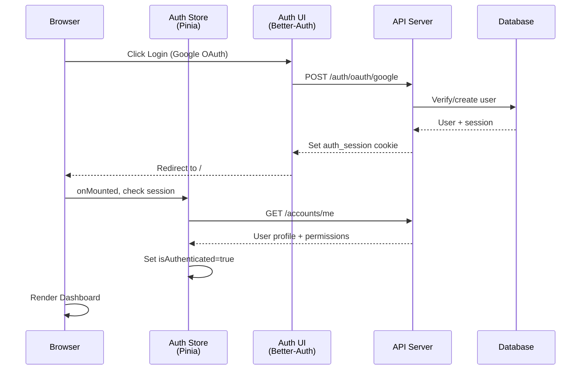

# Dashboard Architecture

> Generated: May 9, 2026 | Branch: development | Commit: 07478fe

## Overview

The Dashboard is a Nuxt 3 Single Page Application (SPA) designed for administrative access to Nexo AI. SSR is disabled to simplify authentication and avoid hydration mismatches with cookie-based sessions. The app uses Pinia for centralized state management, TanStack Query for server-state synchronization, and CASL for client-side authorization checks.

**Key design decisions:**
- **No SSR:** Simplifies auth flow, eliminates hydration issues
- **Pinia stores:** Single source of truth for auth state + preferences
- **TanStack Query:** Automatic caching, background refetches, stale-while-revalidate
- **CASL:** Define abilities in code, check in templates
- **Responsive:** Mobile-friendly Nuxt UI components
- **Offline support:** Cached data persists across page reloads

## Data flow: Login to Dashboard



## Component hierarchy

```
app.vue (root)
├── NuxtLayout
│   ├── Sidebar (navigation)
│   └── NuxtPage (route-specific page)
│       ├── pages/index.vue (Dashboard home)
│       │   ├── AnalyticsCard.vue
│       │   ├── StatsCard.vue
│       │   └── Charts
│       ├── pages/memories.vue (Memory management)
│       │   ├── SearchBar.vue
│       │   ├── MemoryTable.vue
│       │   └── FilterPanel.vue
│       ├── pages/conversations.vue (Audit trail)
│       │   ├── ConversationList.vue
│       │   └── MessageTimeline.vue
│       ├── pages/users.vue (Admin)
│       │   └── UserTable.vue
│       └── pages/settings.vue (Preferences)
│           ├── ThemeToggle.vue
│           └── PreferencesForm.vue
└── Analytics (Vercel Web Analytics)
```

## Store architecture (Pinia)

### Auth Store (`stores/auth.ts`)

Manages user session and authentication state.

```ts
interface AuthStore {
  user: User | null;
  isAuthenticated: boolean;
  permissions: string[];
  
  // Methods
  login(email, password);
  loginWithOAuth(provider);
  logout();
  checkSession();
  refreshPermissions();
}
```

**Key behaviors:**
- Fetches user profile on app mount
- Stores permissions for CASL ability
- Listens to auth_session cookie changes
- Auto-logout on 401 responses

### Preferences Store (`stores/preferences.ts`)

User settings and theme preferences.

```ts
interface PreferencesStore {
  theme: 'light' | 'dark' | 'system';
  language: 'en' | 'pt-BR';
  notifications: { enabled: boolean };
  
  // Methods
  fetchPreferences();
  updateTheme(theme);
  updateLanguage(lang);
}
```

### UI Store (`stores/ui.ts`)

Transient UI state (modal open/close, sidebar collapsed, etc.).

```ts
interface UIStore {
  sidebarOpen: boolean;
  modalOpen: Record<string, boolean>;
  
  // Methods
  toggleSidebar();
  openModal(id);
  closeModal(id);
}
```

## Composable patterns (TanStack Query)

### useDashboard (main data hook)

```ts
export const useDashboard = () => {
  const getAnalytics = async () => {
    const { data } = await api.get('/analytics');
    return data;
  };
  
  const { data: analytics, isLoading, error } = useQuery({
    queryKey: ['analytics'],
    queryFn: getAnalytics,
    staleTime: 5 * 60 * 1000,
  });
  
  return { analytics, isLoading, error };
};
```

**Usage:**
```vue
<script setup>
const { analytics } = useDashboard();
</script>

<template>
  <div>{{ analytics?.users }}</div>
</template>
```

### useAuthStore (auth composable)

```ts
export const useAuthStore = defineStore('auth', () => {
  const user = ref<User | null>(null);
  const isAuthenticated = computed(() => !!user.value);
  
  const checkSession = async () => {
    try {
      const response = await api.get('/accounts/me');
      user.value = response.data;
    } catch (error) {
      user.value = null;
    }
  };
  
  onMounted(() => checkSession());
  
  return { user, isAuthenticated, checkSession };
});
```

## Authorization (CASL)

Define abilities in a central location:

```ts
// app/composables/useAbility.ts
import { defineAbility } from '@casl/ability';
import { useAuthStore } from '@/stores/auth';

export const useAbility = () => {
  const authStore = useAuthStore();
  
  const ability = defineAbility((can, cannot) => {
    if (authStore.user?.role === 'admin') {
      can('manage', 'all');
    } else {
      can('read', ['memories', 'conversations']);
      can('update', 'user', { id: authStore.user?.id });
    }
  });
  
  return ability;
};
```

**Check abilities in templates:**
```vue
<template>
  <button v-if="can('delete', 'memory')">Delete</button>
</template>
```

## API client (`utils/api.ts`)

Axios instance with automatic auth header injection:

```ts
import axios from 'axios';

export const api = axios.create({
  baseURL: import.meta.env.VITE_API_URL || 'http://localhost:3001',
  withCredentials: true, // Include cookies
});

// Attach auth token if available
api.interceptors.request.use((config) => {
  const token = localStorage.getItem('auth_token');
  if (token) {
    config.headers.Authorization = `Bearer ${token}`;
  }
  return config;
});

// Redirect to login on 401
api.interceptors.response.use(
  (response) => response,
  (error) => {
    if (error.response?.status === 401) {
      window.location.href = '/login';
    }
    return Promise.reject(error);
  }
);

export default api;
```

## Page structure

### Dashboard Home (`pages/index.vue`)

Displays overview cards, analytics charts, and recent activity.

```vue
<script setup lang="ts">
const { analytics, isLoading } = useDashboard();
const route = useRoute();
const router = useRouter();

const handleVinculate = () => {
  // Handle OAuth callback after login
};
</script>

<template>
  <div class="grid grid-cols-1 md:grid-cols-2 lg:grid-cols-3 gap-4">
    <AnalyticsCard title="Users" :value="analytics?.users" />
    <AnalyticsCard title="Memories" :value="analytics?.memories" />
    <AnalyticsCard title="Conversations" :value="analytics?.conversations" />
  </div>
  
  <div class="mt-8">
    <Chart :data="analytics?.chart_data" />
  </div>
</template>
```

### Memories Page (`pages/memories.vue`)

Search, filter, and manage memory items.

```vue
<script setup lang="ts">
const searchQuery = ref('');
const selectedType = ref<ItemType | null>(null);

const { data: memories } = useQuery({
  queryKey: ['memories', searchQuery, selectedType],
  queryFn: async () => {
    return await api.get('/memories', {
      params: { search: searchQuery.value, type: selectedType.value },
    });
  },
});
</script>

<template>
  <div>
    <SearchBar v-model="searchQuery" />
    <FilterPanel v-model="selectedType" />
    <MemoryTable :items="memories?.items" />
  </div>
</template>
```

### Conversations Page (`pages/conversations.vue`)

View conversation history and user interactions.

```vue
<script setup lang="ts">
const { data: conversations } = useQuery({
  queryKey: ['conversations'],
  queryFn: async () => await api.get('/conversations'),
  staleTime: 10 * 60 * 1000,
});
</script>

<template>
  <ConversationList :items="conversations" />
</template>
```

## Testing strategy

### Unit Tests (Vitest)

Test composables, stores, and utility functions:

```ts
// composables/useDashboard.test.ts
import { describe, it, expect, vi } from 'vitest';
import { useDashboard } from './useDashboard';

describe('useDashboard', () => {
  it('fetches analytics data', async () => {
    vi.mock('@/utils/api', () => ({
      api: {
        get: vi.fn().mockResolvedValue({
          data: { users: 100, memories: 500 },
        }),
      },
    }));
    
    const { analytics } = await useDashboard();
    expect(analytics.users).toBe(100);
  });
});
```

### E2E Tests (Playwright)

Test user flows end-to-end:

```ts
// tests/dashboard.spec.ts
import { test, expect } from '@playwright/test';

test('user can login and view dashboard', async ({ page }) => {
  await page.goto('http://localhost:5173');
  
  // Login flow
  await page.click('button:has-text("Login with Google")');
  await page.fill('input[type="email"]', 'user@example.com');
  await page.fill('input[type="password"]', 'password');
  await page.click('button[type="submit"]');
  
  // Verify dashboard renders
  await expect(page).toHaveURL('/');
  await expect(page.locator('text=Users')).toBeVisible();
});
```

## Deployment

The dashboard is deployed as a static SPA:

```bash
pnpm run build  # Outputs to .output/public
```

**Deployment targets:**
- Vercel (default, via vercel.json)
- Netlify
- Docker
- Static file server

**Environment variables:**
- `VITE_API_URL` — API endpoint (default: `http://localhost:3001`)
- `VITE_AUTH_DOMAIN` — Better-Auth domain

---

**See also:** [MODULES.md](./MODULES.md)
