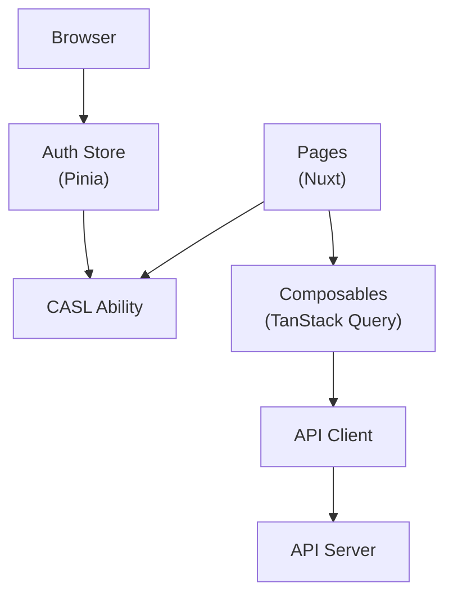

# Nexo Dashboard — Codebase Context

> Generated: May 9, 2026 | Branch: development | Commit: 07478fe

## What is this

The Nexo Dashboard (`@nexo/dashboard`) is a Nuxt 3 administrative web application for managing user data, viewing analytics, and administering the Nexo AI system. It's an SPA (no SSR) that authenticates users via Better-Auth, enforces role-based access control (CASL), and displays real-time dashboards, memory management interfaces, and conversation audits. Built with Vue 3, TanStack Query, and Nuxt UI components.

## Architecture at a glance

The dashboard follows a **SPA + Pinia store → TanStack Query → API** architecture. Authentication and authorization are enforced client-side (CASL ability) and server-side (API middleware). The app is responsive, works offline with cached data, and uses Vue Query for efficient data fetching and synchronization.



## Tech stack summary

| Category | Details |
|----------|---------|
| **Framework** | Nuxt 3, Vue 3.5, TypeScript |
| **SSR** | Disabled (SPA only) |
| **State** | Pinia (authentication, preferences) |
| **Data fetching** | TanStack Query (React Query Vue adapter) |
| **Authorization** | CASL/Vue (role-based access control) |
| **UI Components** | Nuxt UI, Heroicons, Lucide Vue |
| **Testing** | Vitest (unit), Playwright (E2E) |
| **Linting/Format** | ESLint, Biome |
| **Build** | Vite, vue-tsc |
| **Deployment** | Vercel (static SPA) |

## Quick stats

| Metric | Value |
|--------|-------|
| **Source files** | 46 (`.ts` + `.vue`) |
| **Lines of code** | ~8,400 |
| **Pages** | 8+ (dashboard, memories, conversations, settings, etc.) |
| **Composables** | 5+ (useDashboard, useAuthStore, etc.) |
| **Components** | 20+ (cards, modals, tables, charts) |
| **Tests** | 161 test files (unit + E2E) |
| **Test coverage** | ~60% (Vitest + Playwright) |

## Critical patterns

### 1. Authentication Flow

Better-Auth handles session management:

```ts
// app/stores/auth.ts
const authStore = useAuthStore();
authStore.login({ email, password }); // Or OAuth
// Sets auth_session cookie, stores user in pinia
```

### 2. Authorization (CASL)

Role-based access control via CASL ability:

```ts
// app/composables/useAbility.ts
const { can } = useAbility();
if (can('delete', 'memory')) {
  // Show delete button
}
```

### 3. Data Fetching (TanStack Query)

Efficient caching and background refetching:

```ts
// app/composables/useDashboard.ts
const { data: analytics } = useQuery({
  queryKey: ['analytics'],
  queryFn: async () => await api.get('/analytics'),
  staleTime: 5 * 60 * 1000, // Cache for 5 min
});
```

## Directory structure

```
apps/dashboard/
  ├── app/
  │   ├── app.vue               # Root component
  │   ├── app.config.ts         # Nuxt config
  │   ├── pages/                # Route pages
  │   │   ├── index.vue         # Dashboard home
  │   │   ├── memories.vue      # Memory management
  │   │   ├── conversations.vue # Conversation audit
  │   │   ├── users.vue         # User management (admin)
  │   │   └── settings.vue      # User settings
  │   ├── components/           # Reusable components
  │   │   ├── AnalyticsCard.vue
  │   │   ├── MemoryTable.vue
  │   │   └── ...
  │   ├── composables/          # Composable hooks
  │   │   ├── useDashboard.ts   # Dashboard data queries
  │   │   ├── useAuthStore.ts   # Auth state
  │   │   └── usePreferences.ts # User preferences
  │   ├── stores/               # Pinia stores
  │   │   ├── auth.ts           # Authentication
  │   │   ├── preferences.ts    # User settings
  │   │   └── ui.ts             # UI state (theme, etc.)
  │   ├── types/                # TypeScript types
  │   │   └── dashboard.ts      # Dashboard-specific types
  │   ├── utils/                # Utilities
  │   │   ├── api.ts            # Axios instance
  │   │   └── formatters.ts     # Data formatters
  │   ├── assets/               # Static assets
  │   │   └── css/main.css      # Tailwind styles
  │   └── config/               # Configuration
  │       └── env.ts            # Environment validation
  ├── nuxt.config.ts            # Nuxt configuration
  ├── playwright.config.ts       # E2E test config
  ├── vitest.config.ts          # Unit test config
  ├── tailwind.config.js        # Tailwind CSS config
  ├── tsconfig.json
  └── package.json
```

## Context documents

| Document | Description |
|----------|-------------|
| [ARCHITECTURE.md](./ARCHITECTURE.md) | Nuxt structure, store patterns, data flow |
| [MODULES.md](./MODULES.md) | Component hierarchy, page structure, composables |

---

**Related:** [`../../ARCHITECTURE.md`](../../ARCHITECTURE.md) (Monorepo overview)
