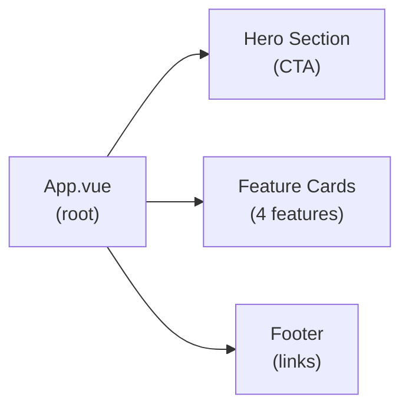

# Nexo Landing Page — Codebase Context

> Generated: May 9, 2026 | Branch: development | Commit: 07478fe

## What is this

The Nexo Landing Page (`@nexo/landing`) is a simple marketing/public-facing web page built with Vite + Vue 3. It showcases the Nexo AI system's features, value proposition, and calls-to-action (sign up, try the bot). Hosted as a static site on Vercel.

## Architecture at a glance

The landing page is a single-page Vue app with a hero section, feature showcase, testimonials, and footer. No backend needed; purely static/marketing content with minimal interactivity.



## Tech stack

| Component | Details |
|-----------|---------|
| **Framework** | Vue 3.5, Vite |
| **Styling** | Tailwind CSS |
| **Icons** | Lucide Vue Next |
| **Build** | Vite, vue-tsc |
| **Deployment** | Vercel (static) |
| **LOC** | ~400 lines |

## Directory structure

```
apps/landing/src/
  ├── main.ts              # Entry point
  ├── App.vue              # Root component
  ├── App.css              # Global styles
  ├── components/          # Reusable components
  │   ├── HeroSection.vue
  │   ├── FeatureCard.vue
  │   └── Footer.vue
  └── assets/              # Images, logos
```

## Key components

### App.vue

Root component that composes sections:

```vue
<template>
  <div class="min-h-screen bg-white">
    <HeroSection />
    <FeatureCards />
    <Footer />
  </div>
</template>

<script setup lang="ts">
const usersCount = ref(1534);
// Animate counter on mount
</script>
```

### HeroSection.vue

Main call-to-action with logo, headline, and sign-up button.

```vue
<template>
  <section class="bg-gradient-to-br from-blue-600 to-purple-600 py-20">
    <div class="container mx-auto text-white text-center">
      <h1 class="text-5xl font-bold mb-4">Your Personal AI Assistant</h1>
      <p class="text-xl mb-8">Save movies, links, notes—across any platform</p>
      <button class="bg-white text-blue-600 px-8 py-3 rounded-lg font-bold">
        Start Now
      </button>
    </div>
  </section>
</template>
```

### FeatureCard.vue

Reusable card for each feature:

```vue
<template>
  <div class="bg-gray-50 p-6 rounded-lg">
    <component :is="icon" class="w-12 h-12 text-blue-600 mb-4" />
    <h3 class="text-xl font-bold mb-2">{{ title }}</h3>
    <p class="text-gray-600">{{ description }}</p>
  </div>
</template>

<script setup lang="ts">
defineProps<{
  icon: any;
  title: string;
  description: string;
}>();
</script>
```

## Build & deployment

### Local development

```bash
cd apps/landing
pnpm run dev      # Starts Vite dev server on http://localhost:5173
pnpm run build    # Outputs to dist/
pnpm run preview  # Preview production build locally
```

### Deployment

Deployed to Vercel via `vercel.json`:

```json
{
  "buildCommand": "pnpm run build",
  "outputDirectory": "dist"
}
```

---

**Related:** [`../../ARCHITECTURE.md`](../../ARCHITECTURE.md) (Monorepo overview)
