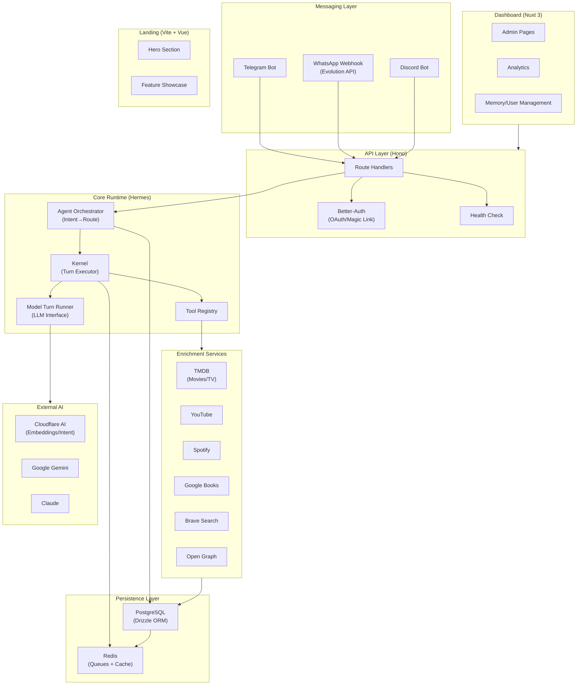

# Nexo AI — Monorepo Codebase Context

> Generated: May 9, 2026 | Branch: development | Commit: 07478fe

## What is this

Nexo AI is a conversational messaging assistant that helps users save, search, and manage content (movies, shows, videos, links, notes) across multiple messaging platforms—Telegram, WhatsApp, and Discord. It leverages multi-provider AI inference, semantic memory, and an agent orchestration runtime to deliver intelligent content enrichment and retrieval at scale.

The system is designed as a monorepo with three distinct applications: a deterministic runtime API (Hermes), an administrative dashboard for management and analytics, and a marketing landing page. It uses PostgreSQL for persistence, Redis for caching and job queues, and Cloudflare Workers AI for embeddings and inference.

## Architecture at a glance

Nexo AI follows a **deterministic agent orchestration architecture** where the control flow is managed entirely by code—LLM outputs are strictly validated against JSON schemas and executed through a tool registry. The system supports multi-provider AI backends (Gemini, Claude, LM Studio), intent classification, semantic memory search, and skill-based extensibility. Each messaging adapter (Telegram, WhatsApp, Discord) interfaces through dedicated webhook handlers into a unified conversation state machine.

## Tech stack summary

| Component | Stack |
|-----------|-------|
| **Language(s)** | TypeScript 5.x (all workspaces) |
| **Monorepo** | pnpm workspaces + Turbo v2.5 |
| **API** | Node.js + Hono 4.x + tsx |
| **Dashboard** | Nuxt 3 (SSR disabled) + Vue 3 + TanStack Query + CASL |
| **Landing** | Vite + Vue 3.5 |
| **Database** | PostgreSQL 15+ + Drizzle ORM 0.45 + Migrations |
| **Observability** | Sentry + OpenTelemetry (OTEL) |
| **Messaging Adapters** | Telegram (Grammy), WhatsApp (Evolution API), Discord |
| **AI/ML** | Cloudflare AI, Google Gemini, Claude, LM Studio; Embeddings via Cloudflare |
| **Job Queue** | Bull + Redis 7+ |
| **Auth** | Better-Auth 1.4 (OAuth + Magic Link) |
| **Enrichment APIs** | TMDB, YouTube, Spotify, Google Books, Brave Search, Open Graph |
| **Build Tools** | Biome (linting), Vitest (testing), Vue-tsc, Playwright (E2E) |
| **Infra** | Docker, Docker Compose, Railway/Vercel (deployment) |

## Quick stats

| Metric | Value |
|--------|-------|
| **Monorepo version** | 0.5.48 |
| **Apps** | 3 (API, Dashboard, Landing) |
| **Shared packages** | 4 (env, shared, otel, typescript-config) |
| **API source files** | 99 `.ts` files |
| **API LOC** | ~5,400 |
| **API tests** | 1 test file (test coverage low) |
| **Dashboard files** | 46 (`.ts` + `.vue`) |
| **Dashboard LOC** | ~8,400 |
| **Dashboard tests** | 161 test files (Vitest + Playwright) |
| **Landing LOC** | ~400 (simple landing page) |
| **Packages LOC** | ~2,400 |
| **Databases** | PostgreSQL (primary), Redis (caching/queues) |
| **External services** | 10+ (TMDB, YouTube, Spotify, Cloudflare, Sentry, etc.) |

## Critical knowledge

1. **LLM never controls state/flow (ADR-011):** Code controls all orchestration; LLM outputs must match `AgentLLMResponse` schema or execution fails. This prevents unexpected behavior and ensures determinism.

2. **Prompts are centralized:** All LLM prompts live in `apps/api/src/config/prompts.ts`. Do not scatter prompt text across services; update in one place to avoid divergence.

3. **Deterministic runtime is the core contract:** The Hermes kernel executes validated tools in a loop (max 6 steps). If the LLM tries to invoke an undefined tool or outputs malformed JSON, it fails gracefully and returns an error to the user.

4. **Multi-provider AI support (NEX-53):** Providers are registered in `provider-keys` and `providers` tables. The system routes to the registered provider (Cloudflare default, fallback to Gemini/Claude). Do not hardcode provider calls; always use the credential pool.

5. **Conversation state is JSONB:** User context and conversation history are stored in `conversations.context` (Drizzle JSONB type). State transitions happen via `conversationService.transition()`, not ad-hoc DB writes.

6. **Semantic memory uses embeddings:** Memory items are stored with computed embeddings. Search is hybrid (keyword + semantic). Embeddings are cached via Cloudflare and invalidated on memory updates.

7. **Bull queue for async work:** All message processing is queued (Bull + Redis) to avoid webhook timeouts. Check queue status via Redis and monitor for stuck jobs.

8. **Better-Auth is the auth layer:** OAuth providers (Google, GitHub) and Magic Link flow route through Better-Auth. Token exchange happens server-side; never expose secrets client-side.

9. **ADRs are the source of truth:** Before making architectural decisions, check `apps/api/docs/adr/` to understand prior choices. Key ADRs: 011 (deterministic runtime), 007 (multi-provider), 014 (enrichment strategy).

10. **Webhook idempotency is critical:** Each messaging adapter generates unique IDs for events. Duplicate webhooks must be deduplicated in-memory or via DB unique constraints to prevent double-processing.

## Context documents

| Document | Scope | Description |
|----------|-------|-------------|
| [ARCHITECTURE.md](./ARCHITECTURE.md) | Monorepo | High-level architecture, system design, component topology |
| [TECH_STACK.md](./TECH_STACK.md) | Monorepo | Technology choices, dependencies, versions |
| [SHARED_PACKAGES.md](./SHARED_PACKAGES.md) | Monorepo | Shared package inventory (env, shared, otel) |
| [PATTERNS.md](./PATTERNS.md) | Monorepo | Recurring code patterns, conventions, idioms |
| [CONVENTIONS.md](./CONVENTIONS.md) | Monorepo | Code quality, linting, API design, testing standards |
| [GLOSSARY.md](./GLOSSARY.md) | Monorepo | Project-specific terminology and acronyms |
| [BUILD_AND_DEPLOY.md](./BUILD_AND_DEPLOY.md) | Monorepo | Build system, CI/CD, deployment guides |
| **API** | — | — |
| [apps/api/index.md](./apps/api/index.md) | API | API-specific codebase overview |
| [apps/api/ARCHITECTURE.md](./apps/api/ARCHITECTURE.md) | API | Hermes runtime, kernel, orchestration |
| [apps/api/MODULES.md](./apps/api/MODULES.md) | API | Service and module inventory |
| [apps/api/DATA_LAYER.md](./apps/api/DATA_LAYER.md) | API | Database schema, ORM patterns, migrations |
| [apps/api/API_SURFACE.md](./apps/api/API_SURFACE.md) | API | REST endpoints, webhooks, contracts |
| [apps/api/DOMAIN_MODEL.md](./apps/api/DOMAIN_MODEL.md) | API | Business entities, memory model, content types |
| [apps/api/TECH_DEBT.md](./apps/api/TECH_DEBT.md) | API | Known issues, coupling hotspots, test gaps |
| **Dashboard** | — | — |
| [apps/dashboard/index.md](./apps/dashboard/index.md) | Dashboard | Dashboard-specific codebase overview |
| [apps/dashboard/ARCHITECTURE.md](./apps/dashboard/ARCHITECTURE.md) | Dashboard | Nuxt 3 structure, store pattern, composables |
| [apps/dashboard/MODULES.md](./apps/dashboard/MODULES.md) | Dashboard | Component hierarchy, page structure |
| **Landing** | — | — |
| [apps/landing/index.md](./apps/landing/index.md) | Landing | Landing page structure and components |

## How to use this documentation

1. **New to the project?** Start with [ARCHITECTURE.md](./ARCHITECTURE.md) for the big picture.
2. **Working on the API?** Jump to [apps/api/index.md](./apps/api/index.md).
3. **Building dashboard features?** See [apps/dashboard/index.md](./apps/dashboard/index.md).
4. **Making architectural decisions?** Read [apps/api/docs/adr/](../apps/api/docs/adr/) first.
5. **Debugging a crash?** Check [apps/api/TECH_DEBT.md](./apps/api/TECH_DEBT.md) for known issues.

---

**Last updated:** May 9, 2026 | Keep docs in sync with code changes.
